# Laura Parke ECE 5610-002
---------------------------------------------------------
Lab-5: Buck-Boost Converter

Lab 5 Items:
- Waveform Captures
Buck-Boost Converter Analysis

Abstract: We looked at the characteristics of a simple buck-boost converter. The circuit was operated under continuous conduction mode (CCM) and open loop conditions, which means no feedback. In this lab, we compare the theoretical results with the experimental results. The simulation observes switching waveforms in a near-ideal buck-boost converter operating at a fixed duty cycle.  Simulated results are compared to both theoretical calculations and experimental results.

Measurements and Waveforms

1. Set the duty ratio to 10%, switching frequency at 100 kHz and RL = 20Ω.
   
   Vary the duty ratio from 10% to 60% (in steps of 10%):
   
   Duty Ratio | 10% | 20% | 30% | 40% | 50% | 60%

   Measure the average output voltage for the corresponding duty ratios:

   Vout Exp V | 0.89 | 2.06 | 3.69 | 5.89 | 8.89 | 13.03

   Calculate the theoretical average output voltage for the corresponding duty ratios:

   Vout Thr V | 1.11 | 2.50 | 4.29 | 6.67 | 10.0 | 15.0
   

section 5.4.1: Varying Duty Ratio
----------------------------------------------------------
- duty ratio @ 10%
- Load Resistance = 20 Ω
- Switching Frequency = 100 kHz
- External Input Voltage Vd = 10V (DC Power Supply)

scope_65:
- Ch1: PWM reference measurement of Power Pole Board -> Duty 10% @ 100kHz
- Ch2: Ouput Voltage measure across V2+ and COM

 PWM Reference Signal of Power Pole Board -> Duty 10% @ 100kHz|
:-------------------------:|
 |

scope_66:
- Ch1: PWM reference measurement of Power Pole Board -> Duty 10% @ 100kHz
- Ch2: Ouput Voltage measure across V2+ and COM
  
 PWM Reference Signal of Power Pole Board -> Duty 10% @ 100kHz Resistance = 20 Ω|
:-------------------------:|
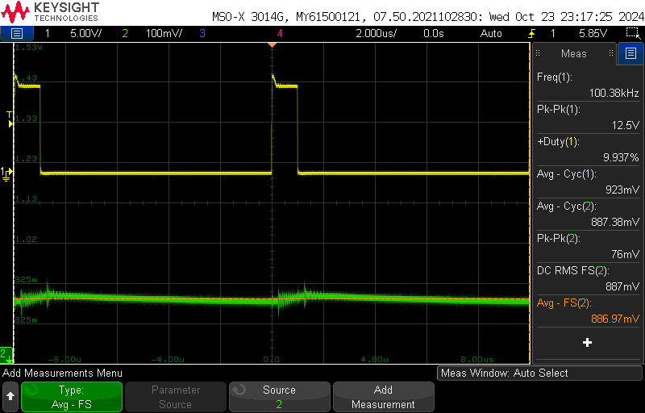 |

scope_67:
- Ch1: PWM reference measurement of Power Pole Board -> Duty 20% @ 100kHz
- Ch2: Ouput Voltage measure across V2+ and COM

 PWM Reference Signal of Power Pole Board -> Duty 10% @ 100kHz Resistance = 20 Ω|
:-------------------------:|
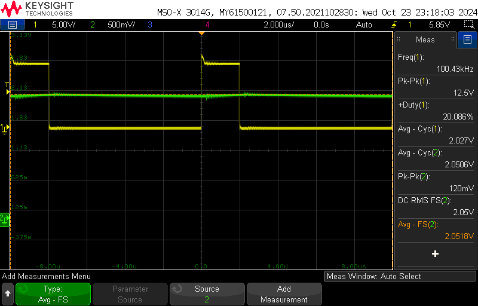 |

scope_68:
- Ch1: PWM reference measurement of Power Pole Board -> Duty 30% @ 100kHz
- Ch2: Ouput Voltage measure across V2+ and COM

 PWM Reference Signal of Power Pole Board -> Duty 30% @ 100kHz Resistance = 20 Ω |
:-------------------------:|
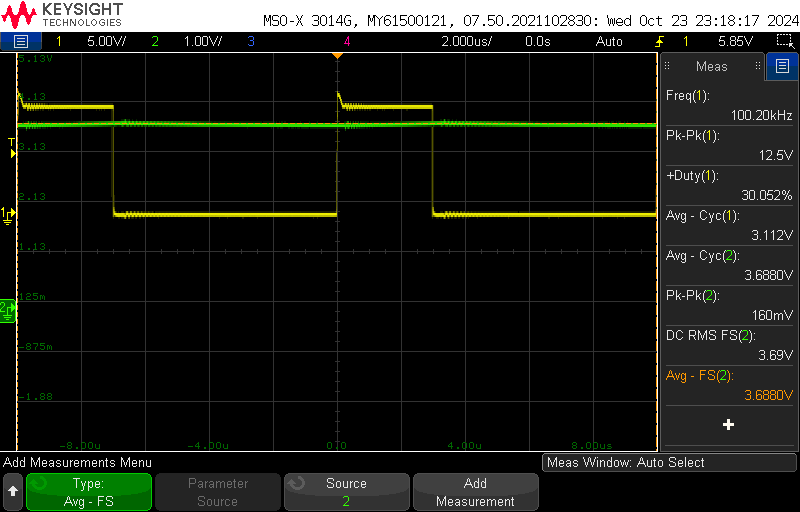 |

scope_69:
- Ch1: PWM reference measurement of Power Pole Board -> Duty 40% @ 100kHz
- Ch2: Ouput Voltage measure across V2+ and COM

 PWM Reference Signal of Power Pole Board -> Duty 40% @ 100kHz Resistance = 20 Ω |
:-------------------------:|
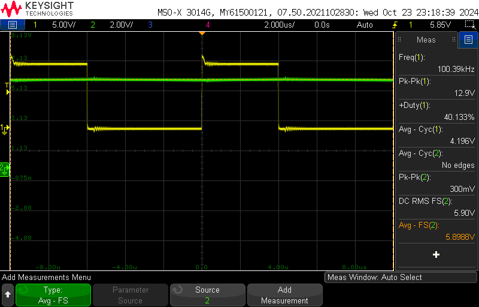 |

scope_70:
- Ch1: PWM reference measurement of Power Pole Board -> Duty 50% @ 100kHz
- Ch2: Ouput Voltage measure across V2+ and COM

 PWM Reference Signal of Power Pole Board -> Duty 50% @ 100kHz Resistance = 20 Ω |
:-------------------------:|
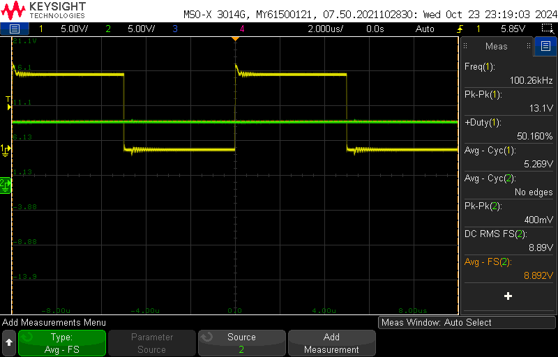 |

scope_71:
- Ch1: PWM reference measurement of Power Pole Board -> Duty 60% @ 100kHz
- Ch2: Ouput Voltage measure across V2+ and COM

 PWM Reference Signal of Power Pole Board -> Duty 60% @ 100kHz Resistance = 20 Ω |
:-------------------------:|
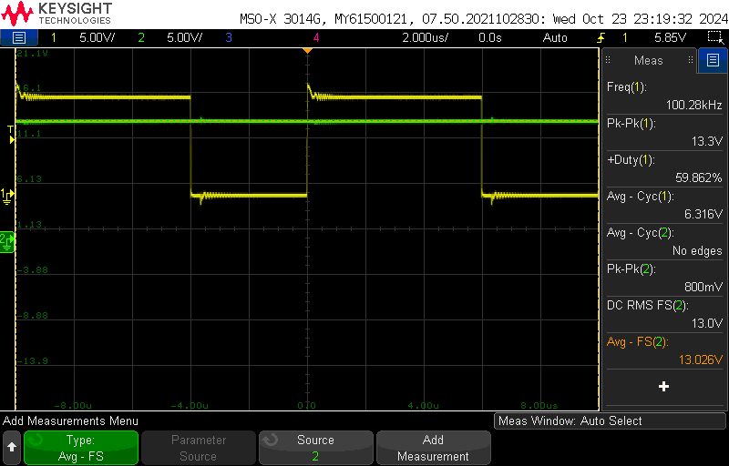 |

section 5.4.2: Varying Switching Frequency
----------------------------------------------------------
- duty ratio @ 60%
- Load Resistance = 15 Ω
- Switching Frequency = 100 kHz
- External Input Voltage Vd = 10V (DC Power Supply)

scope_72:
- Ch1: PWM reference measurement of Power Pole Board -> Duty 60% @ 100kHz
- Ch2: Inductor Voltage measure across CS5 and COM

 PWM Reference Signal of Power Pole Board -> Duty 60% @ 100kHz Resistance = 15 Ω |
:-------------------------:|
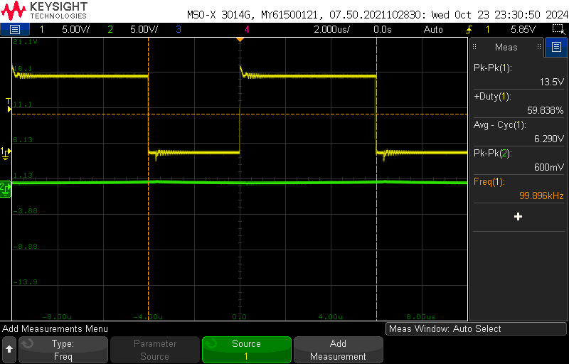 |

scope_73:
- Ch1: PWM reference measurement of Power Pole Board -> Duty 60% @ 100kHz
- Ch2: Inductor Voltage measure across CS5 and COM

 PWM Reference Signal of Power Pole Board -> Duty 60% @ 100kHz Resistance = 15 Ω|
:-------------------------:|
 |

scope_74:
- Ch1: PWM reference measurement of Power Pole Board -> Duty 60% @ 100kHz
- Ch2: Inductor Voltage measure across CS5 and COM

 PWM Reference Signal of Power Pole Board -> Duty 60% @ 100kHz Resistance = 15 Ω|
:-------------------------:|
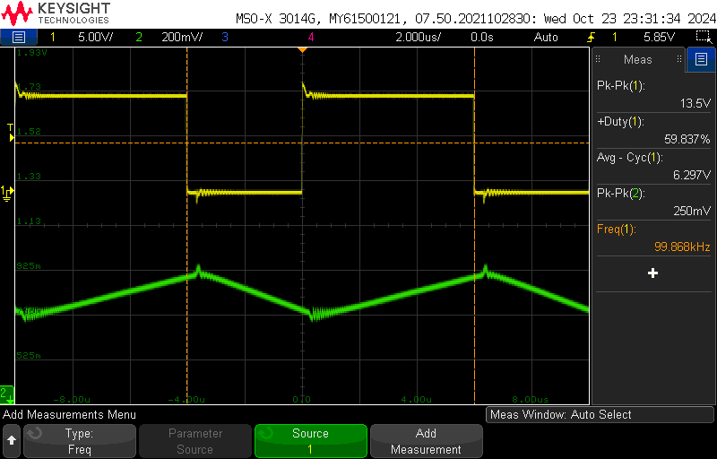 |
scope_75:
- Ch1: PWM reference measurement of Power Pole Board -> Duty 60% @ 80kHz
- Ch2: Inductor Voltage measure across CS5 and COM

 PWM Reference Signal of Power Pole Board -> Duty 60% @ 80kHz Resistance = 15 Ω|
:-------------------------:|
 |

scope_76:
- Ch1: PWM reference measurement of Power Pole Board -> Duty 60% @ 60kHz
- Ch2: Inductor Voltage measure across CS5 and COM

 PWM Reference Signal of Power Pole Board -> Duty 60% @ 60kHz Resistance = 15 Ω|
:-------------------------:|
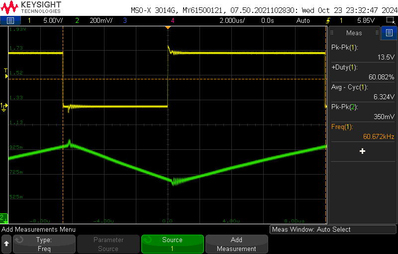 |

scope_77:
- Ch1: PWM reference measurement of Power Pole Board -> Duty 60% @ 40kHz
- Ch2: Inductor Voltage measure across CS5 and COM

 PWM Reference Signal of Power Pole Board -> Duty 60% @ 40kHz Resistance = 15 Ω|
:-------------------------:|
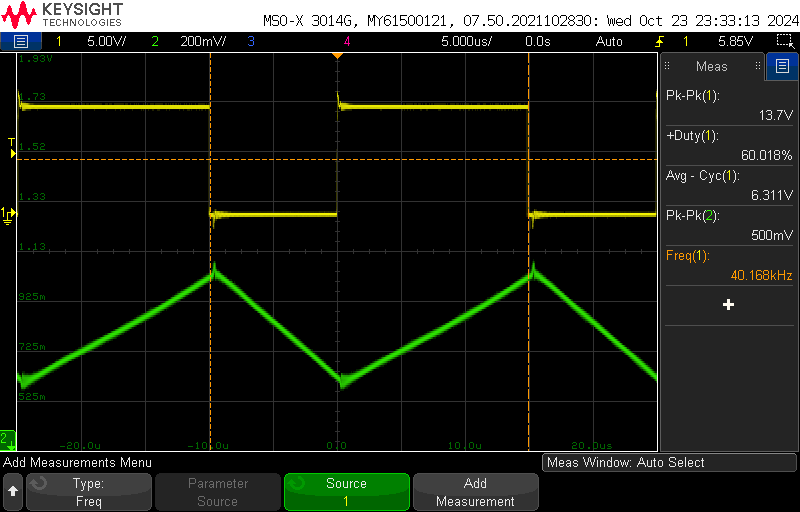 |

section 5.4.3: Determining Efficiency
----------------------------------------------------------
- duty ratio @ 60%
- Load Resistance = 15 Ω
- Switching Frequency = 100 kHz
- External Input Voltage Vd = 10V (DC Power Supply)

scope_78:
- Ch1: PWM reference measurement of Power Pole Board -> Duty 60% @ 60kHz
- Ch2: Output Voltage measure across V2+ and COM

 PWM Reference Signal of Power Pole Board -> Duty 60% @ 60kHz Resistance = 15 Ω|
:-------------------------:|
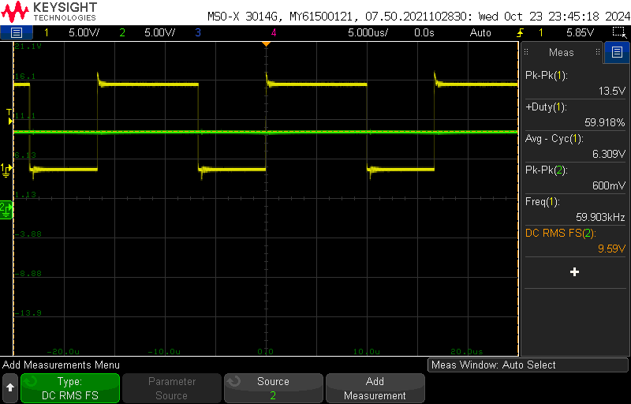 |

scope_79:
- Ch1: PWM reference measurement of Power Pole Board -> Duty 60% @ 60kHz
- Ch2: Output Voltage measure across V2+ and COM

 PWM Reference Signal of Power Pole Board -> Duty 60% @ 60kHz Resistance = 15 Ω|
:-------------------------:|
 |

scope_80:
- Ch1: PWM reference measurement of Power Pole Board -> Duty 60% @ 100kHz
- Ch2: Output Voltage measure across V2+ and COM

 PWM Reference Signal of Power Pole Board -> Duty 60% @ 100kHz Resistance = 15 Ω|
:-------------------------:|
 |

section 5.4.4: Varying Load
----------------------------------------------------------
- duty ratio @ 40%
- Load Resistance = 20 Ω
- Switching Frequency = 40 kHz
- External Input Voltage Vd = 10V (DC Power Supply)

scope_81:
- Ch1: PWM reference measurement of Power Pole Board -> Duty 40% @ 40kHz
- Ch2: Output Voltage measure across V2+ and COM

 PWM Reference Signal of Power Pole Board -> Duty 40% @ 40kHz Resistance = 20 Ω|
:-------------------------:|
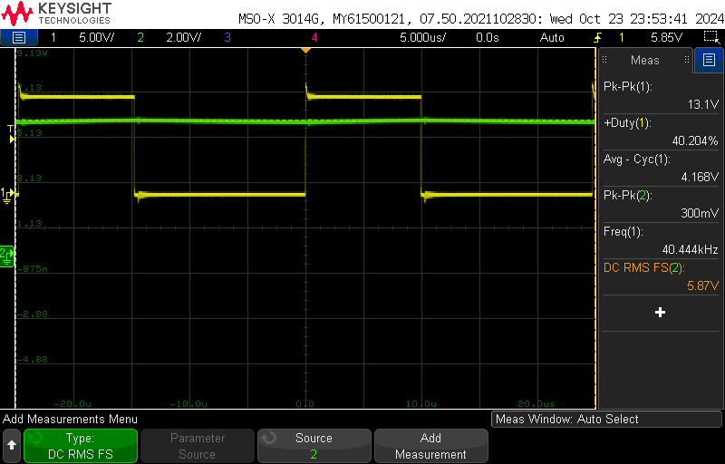 |

scope_82:
- Ch1: PWM reference measurement of Power Pole Board -> Duty 40% @ 40kHz
- Ch2: Output Voltage measure across V2+ and COM

 PWM Reference Signal of Power Pole Board -> Duty 40% @ 40kHz Resistance = 20 Ω|
:-------------------------:|
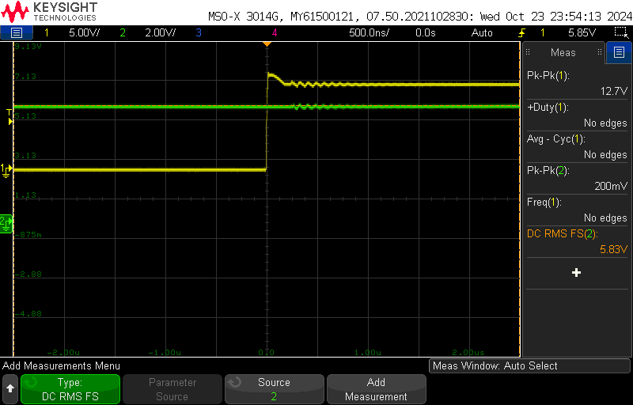 |

scope_83:
- Ch1: PWM reference measurement of Power Pole Board -> Duty 40% @ 40kHz
- Ch2: Output Voltage measure across V2+ and COM

 PWM Reference Signal of Power Pole Board -> Duty 40% @ 40kHz Resistance = 20 Ω|
:-------------------------:|
 |

scope_84:
- Ch1: PWM reference measurement of Power Pole Board -> Duty 40% @ 40kHz
- Ch2: Output Voltage measure across V2+ and COM

 PWM Reference Signal of Power Pole Board -> Duty 40% @ 40kHz Resistance = 20 Ω|
:-------------------------:|
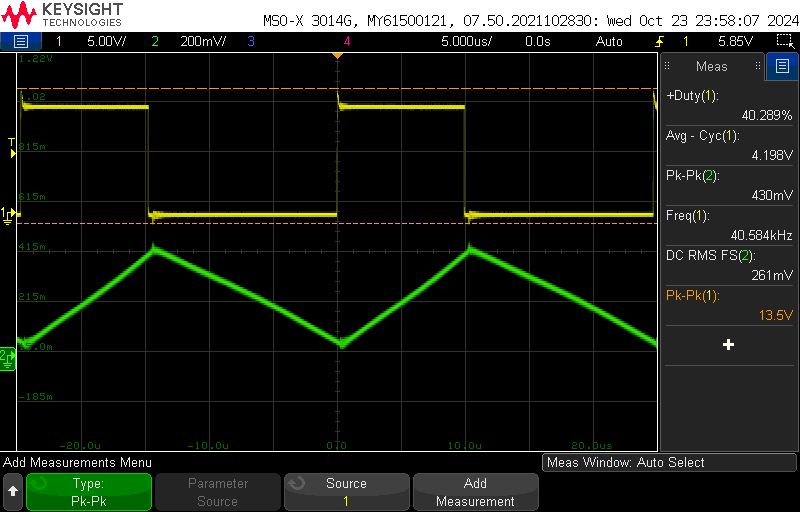 |
scope_85:
- Ch1: PWM reference measurement of Power Pole Board -> Duty 40% @ 40kHz
- Ch2: Output Voltage measure across V2+ and COM
***Discontinuous Conduction Mode due to "flat" valley peaks:
  Load Resistance = 28.7 Ω for DCM

 PWM Reference Signal of Power Pole Board -> Duty 40% @ 40kHz Load Resistance = 28.7 for DCM Ω|
:-------------------------:|
 |
