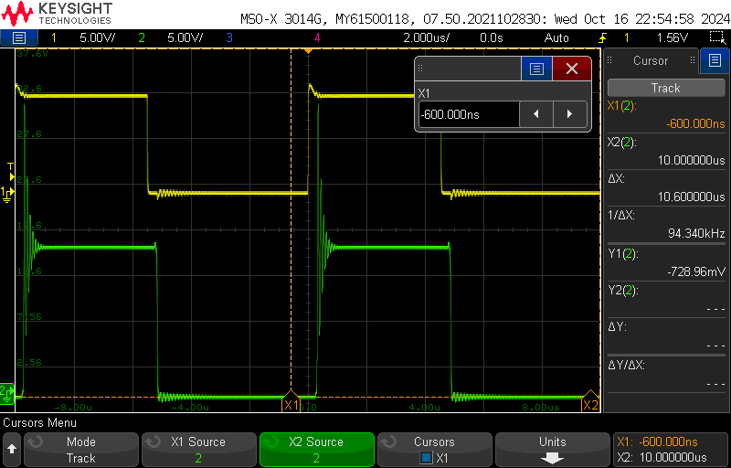
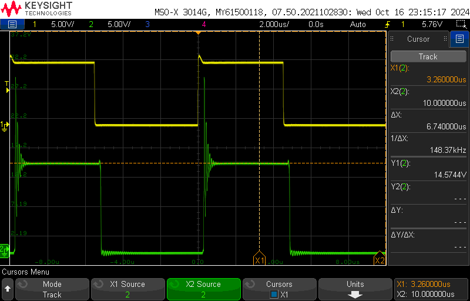
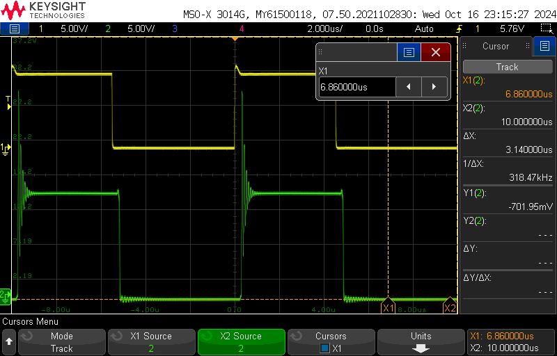
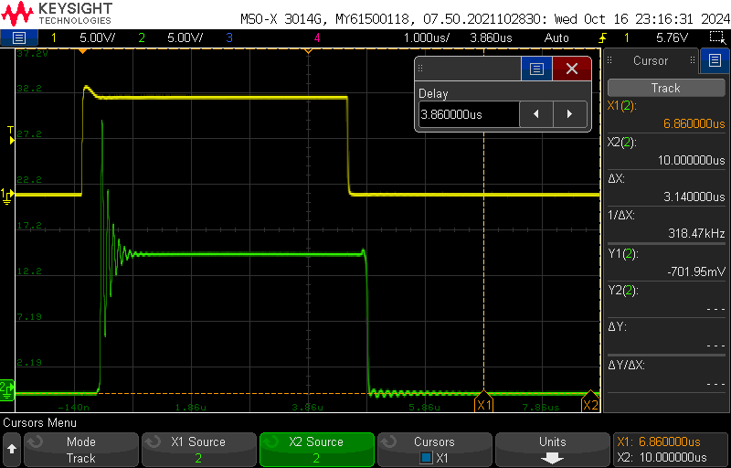
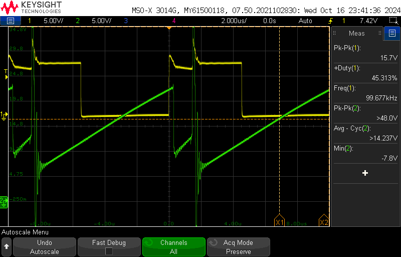
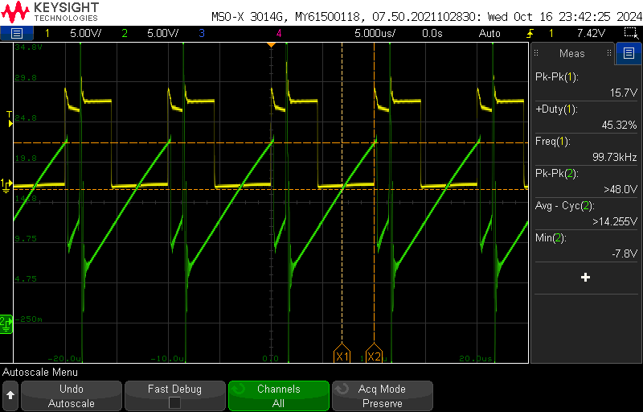
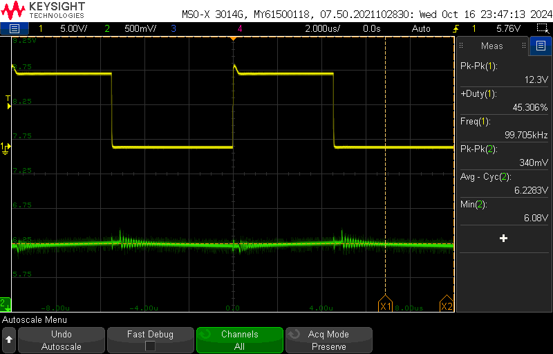
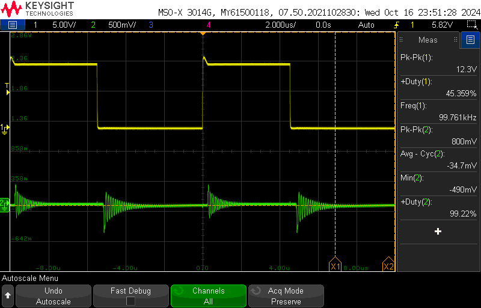
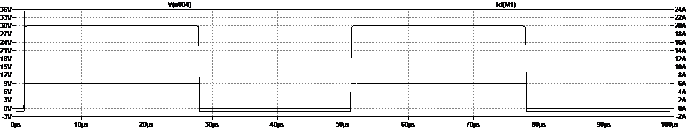

# Laura Parke 
# ECE 5610-001
---------------------------------------------------------
Lab 3 Items:
- Waveform Captures
Buck Converter: MOSFET Analysis

ABSTRACT:  In this experiment we study the switching characteristics of power MOSFETs and power 
diodes using a buck converter. The circuit is operated in open loop conditions with no feedback.
The purpose of this lab is to understand the switching behavior of these two power devices. We perform
Psice simulations to take measurements and compare with values obtained in the datasheet IRF640.  We
estimate switching power losses during the turn-ON and turn-OFF of both the MOSFET and diode.

section 3.4: Measurements and Waveforms
----------------------------------------------------------
- duty ratio @ 50%
- Load Resistance = 10 Ω
- Switching Frequency = 100 kHz
- External Input Voltage Vd = 15V (DC Power Supply)
1. V_ak -> C53 Diode
   Input:
   Ch-1: PWM Output
   Ch-2: V_diode (C53 / GND) -> C53
   
     15.63 V - top flat line
     -0.700 V - bottom flat line
   
   V_diode (V_AK) = 15.63 V - (-0.700V) =16.33 V

     14.7 V - top flat line
     -0.700 V - bottom flat line
   
   V_diode (V_AK) = 14.7 V - (-0.700 V) = 15.4 V
   
   C53:
   460 mV Peak-to-Peak
   R_L = 10 Ω
   I_diode (C53) = 460 mV/10 Ω = 46 mAmps

   760 mV Peak-to-Peak
   R_L = 10 Ω
   I_diode (C53) = 760 mV/10 Ω = 76 mAmps

   PSU:  15 V @ 0.28 Amps (source Vin)
        15(0.3) = 6V(0.700)

3.  Top MOSFET: Ch2: drain and source
    -average: 140 mV/10 Ω = 14 mAmps
    -Pk-pk: 9.6 V
4.  Ch 2:  drain and source of top Mosfet   50+V triangle wave
    -average: 14.256 V
    -average: 13.82 V
    I_ds (mosfet) (CS1) = 140 mV/0.05 Ω = 28 mAmps
5.  V_FM = 0.7 V
6.  I_o = 623 mAmps
    V_o = 6.22 V @ 10 Amps
    
scope_34:
- Using cursor to measure peak flat voltage
- Ch1: PWM reference measurement of Power Pole Board
- Ch2: Anode-Cathode Voltage of lower diode
  
 PWM Reference Signal of Power Pole Board -> Peak Flat Voltage |
:-------------------------:|
 |

scope_35:
- Using cursor to measure minimum flat voltage
- Ch1: PWM reference measurement of Power Pole Board
- Ch2: Anode-Cathode Voltage of lower diode

 PWM Reference Signal of Power Pole Board -> Minimum Flat Voltage |
:-------------------------:|
 |

scope_36:
- Change time to enhance ON behavior
- Ch1: PWM reference measurement of Power Pole Board
- Ch2: Anode-Cathode Voltage of lower diode

 PWM Reference Signal of Power Pole Board -> Change Time |
:-------------------------:|
 |

scope_37:
- Change time view multiple cycles
- Ch1: PWM reference measurement of Power Pole Board
- Ch2: Anode-Cathode Voltage of lower diode

 PWM Reference Signal of Power Pole Board -> Change Time View Multiple Cycles |
:-------------------------:|
 |

scope_38:
- Change time to enhance OFF behavior
- Ch1: PWM reference measurement of Power Pole Board
- Ch2: Anode-Cathode Voltage of lower diode

 PWM Reference Signal of Power Pole Board -> Change Time to Enhance Off Behavior|
:-------------------------:|
 |

***Changed external power supply to different unit for stability concerns of previous scope_34-35***

scope_39:
- Using cursor to measure peak flat voltage
- Ch1: PWM reference measurement of Power Pole Board
- Ch2: Anode-Cathode Voltage of lower diode

 PWM Reference Signal of Power Pole Board -> Peak Flat Voltage |
:-------------------------:|
 |

scope_40:
- Using cursor to measure minimum flat voltage
- Ch1: PWM reference measurement of Power Pole Board
- Ch2: Anode-Cathode Voltage of lower diode

 PWM Reference Signal of Power Pole Board -> Minimum Flat Voltage |
:-------------------------:|
 |

scope_41:
- Change time to enhance ON/OFF behavior
- Ch1: PWM reference measurement of Power Pole Board
- Ch2: Anode-Cathode Voltage of lower diode

 PWM Reference Signal of Power Pole Board -> Change Time to Enhance ON/OFF behavior |
:-------------------------:|
 |

scope_42:
- Ch1: PWM reference measurement of Power Pole Board
- Ch2: Drain-Source MOSFET V_DS

 PWM Reference Signal of Power Pole Board -> PWM Reference Measurement |
:-------------------------:|
 |

scope_43:
- Change time view
- Ch1: PWM reference measurement of Power Pole Board
- Ch2: Drain-Source MOSFET V_DS
 
 PWM Reference Signal of Power Pole Board -> Change Time View |
:-------------------------:|
 |

scope_44:
- Ch1: PWM reference measurement of Power Pole Board
- Ch2: Output load voltage
*Calculate load current I_o

 PWM Reference Signal of Power Pole Board -> PWM Reference Measurement |
:-------------------------:|
 |

scope_45:
- Ch1: PWM reference measurement of Power Pole Board
- Ch2: Output load voltage
*Calculate load current I_o

 PWM Reference Signal of Power Pole Board -> PWM Reference Measurement |
:-------------------------:|
 |

Assignments:

3.6 Spice Simulation

3.6.1 Open the file Power_pole_PSpice_MOSFET.sch. Take a moment to examine the circuit, and then
perform the following measurements.

Assignments:

1, In the schematic shown above, the circuit consists of a MOSFET IRF640 and a diode MUR2020
in the PSpice Library with Rs (Source resistance) =1 mΩ. Obtain the turn-ON switching
characteristics as shown in Fig. below. Plot the drain-source voltage of M1, and the current
through M1 to obtain the switching characteristics.

 MOSFET turn-ON switching characteristics V_DS and I_D
:-------------------------:|
 |

2. Measure tc(ON), tri and tfv in the turn-ON switching characteristics. tc(ON) = 1.152E-6s; tri = 5.44ns; tfv = 22.34 ns.

3. Measure vGS(th) and vGS(Io). Compare these with the values obtained from the datasheet of
IRF640. vGS(th)= 2.067 V as compared to the datasheet vGS(th) = 1V (min). vGS(Io)= 2.199 V @ -2.0fA as compared to the datasheet vGS(Io) = 2V at 250µA [copilot].  

5. Estimate the average switching power loss during the turn-ON.  I calculated the average switching power loss during the turn-ON to be Psw​≈Average VDS​xAverage IDxtc​(ON) = 53.6E-6 W.

6. Obtain the turn-off switching characteristics as shown in the figure above.

 MOSFET turn-OFF switching characteristics V_DS and I_D
:-------------------------:|
 |

7. Measure tc(OFF), trv and tfi in the turn-OFF switching characteristics. tc(OFF) = 934ns,trv = 103s , tfi = 5.44ns.
 
8. Calculate the average switching power loss during the turn-OFF.   I calculated the average switching power loss during the turn-OFF to be Psw​≈Average VDSxAverage ID​xtc​(ON)= 43.4E-6 W.

3.6.2 
Assignments:
1. The schematic above has a diode MUR2020. Obtain the turn-ON and turn-OFF switching
characteristics of the diode similar to the way used for obtaining the MOSFET characteristics.

2. Estimate the average switching power loss during turn-ON and turn-OFF switching
characteristics of the diode similar to the way used for obtaining the MOSFET characteristics.
