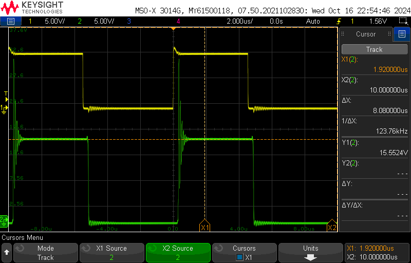
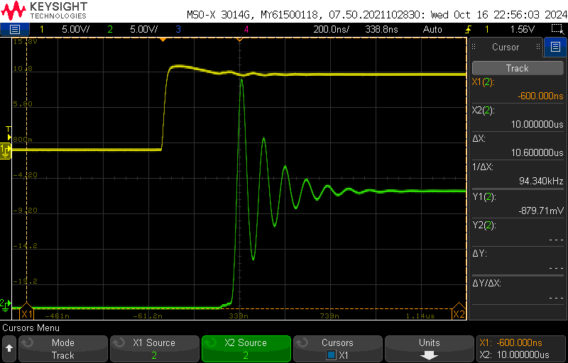
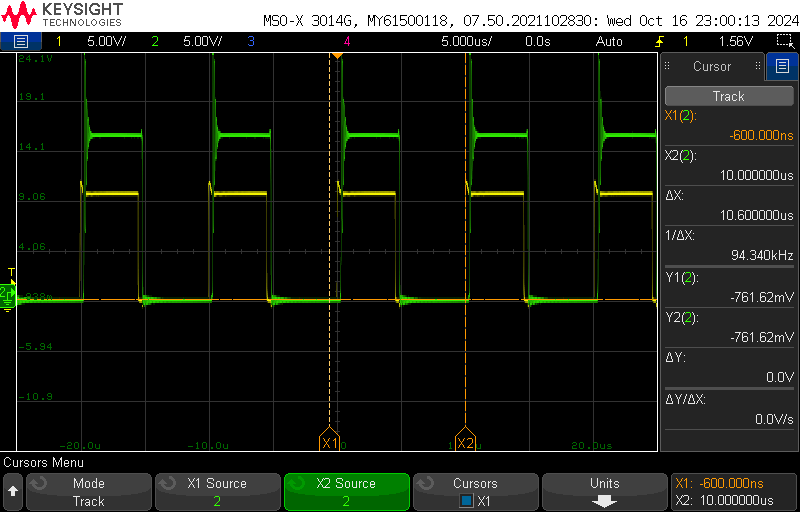
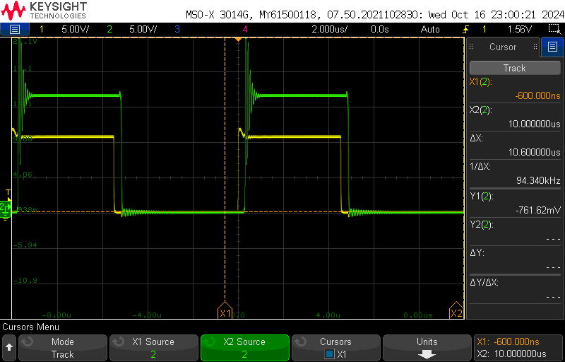

Lab 3 Items:
- Waveform Captures
Buck Converter: MOSFET Analysis

section 3.4: Measurements and Waveforms
----------------------------------------------------------
- duty ratio @ 50%
- Load Resistance = 10 Ω
- Switching Frequency = 100 kHz
- External Input Voltage Vd = 15V (DC Power Supply)

scope_34:
- Using cursor to measure peak flat voltage
- Ch1: PWM reference measurement of Power Pole Board
- Ch2: Anode-Cathode Voltage of lower diode
  
 PWM Reference Signal of Power Pole Board -> Peak Flat Voltage |
:-------------------------:|
 |

scope_35:
- Using cursor to measure minimum flat voltage
- Ch1: PWM reference measurement of Power Pole Board
- Ch2: Anode-Cathode Voltage of lower diode

 PWM Reference Signal of Power Pole Board -> Minimum Flat Voltage |
:-------------------------:|
 |

scope_36:
- Change time to enhance ON behavior
- Ch1: PWM reference measurement of Power Pole Board
- Ch2: Anode-Cathode Voltage of lower diode

 PWM Reference Signal of Power Pole Board -> Change Time |
:-------------------------:|
 |

scope_37:
- Change time view multiple cycles
- Ch1: PWM reference measurement of Power Pole Board
- Ch2: Anode-Cathode Voltage of lower diode

 PWM Reference Signal of Power Pole Board -> Change Time View Multiple Cycles |
:-------------------------:|
 |

scope_38:
- Change time to enhance OFF behavior
- Ch1: PWM reference measurement of Power Pole Board
- Ch2: Anode-Cathode Voltage of lower diode

 PWM Reference Signal of Power Pole Board -> Change Time to Enhance Off Behavior|
:-------------------------:|
 |

***Changed external power supply to different unit for stability concerns of previous scope_34-35***

scope_39:
- Using cursor to measure peak flat voltage
- Ch1: PWM reference measurement of Power Pole Board
- Ch2: Anode-Cathode Voltage of lower diode

scope_40:
- Using cursor to measure peak flat voltage
- Ch1: PWM reference measurement of Power Pole Board
- Ch2: Anode-Cathode Voltage of lower diode

scope_41:
- Change time to enhance ON/OFF behavior
- Ch1: PWM reference measurement of Power Pole Board
- Ch2: Anode-Cathode Voltage of lower diode

scope_42:
- Ch1: PWM reference measurement of Power Pole Board
- Ch2: Drain-Source MOSFET V_DS

scope_43:
- Change time view
- Ch1: PWM reference measurement of Power Pole Board
- Ch2: Drain-Source MOSFET V_DS

scope_44:
- Ch1: PWM reference measurement of Power Pole Board
- Ch2: Output load voltage
*Calculate load current I_o

scope_45:
- Ch1: PWM reference measurement of Power Pole Board
- Ch2: Output load voltage
*Calculate load current I_o

