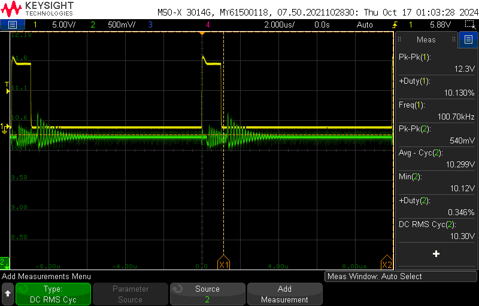
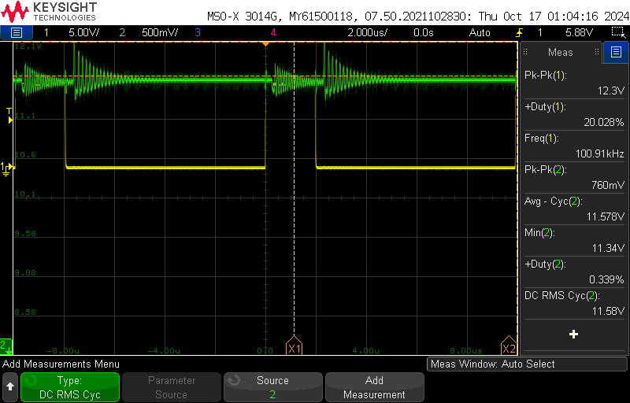
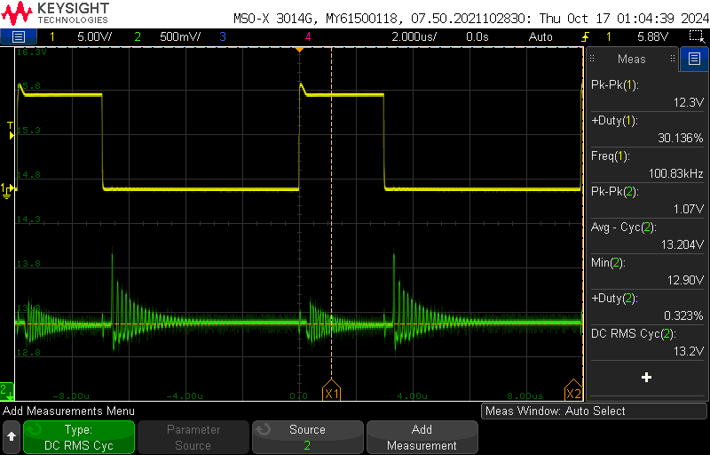
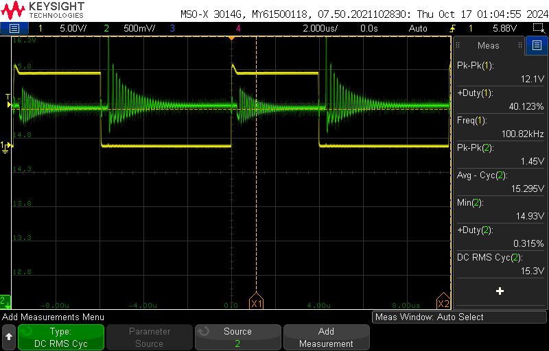
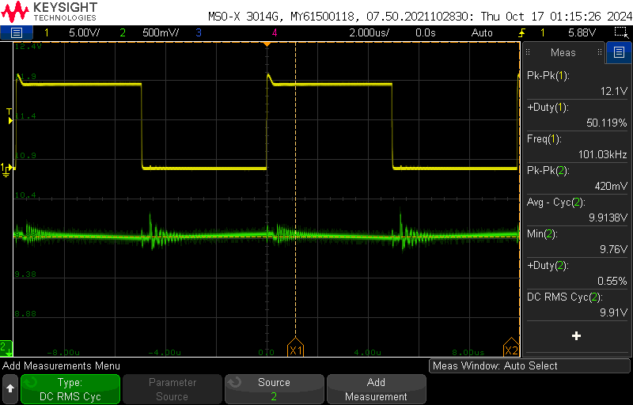
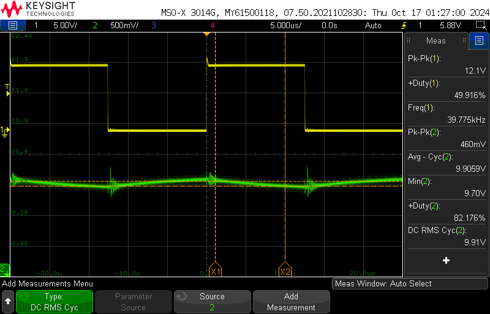
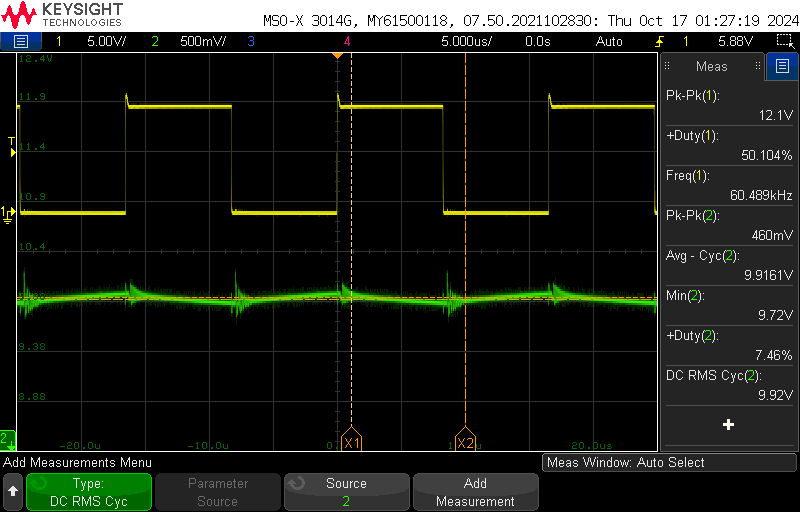
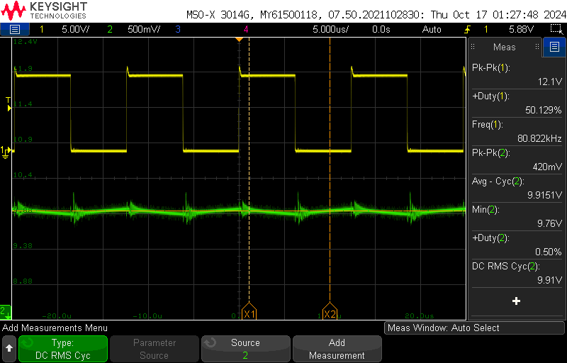

Laura Parke
ECE 5610-002
--------------------------------------------------------
Lab 4 Items:
- Waveform Captures
Boost Converter Analysis

Abstract:   The characteristics of a simple boost converter were studied in this experiment. The circuit will
was operated under continuous conduction mode (CCM) and open loop conditions, which means no feedback.  We compare 
the theoretical results with the experimental results.  The simulation is used to observe switching waveforms in a 
near-ideal boost converter operating at a fixed duty cycle.  Simulated results are compared to theoretical calculations and experimental results.

Measurements and Waveforms

section 4.4.1: Varying Duty Ratio
----------------------------------------------------------
- duty ratio @ 10%
- Load Resistance = 20 Ω
- Switching Frequency = 100 kHz
- External Input Voltage Vd = 10V (DC Power Supply)

1.  Set the duty ratio to10%, switching frequency at 100 kHz and RL = 20 Ω.

    Vary the duty ratio from 10% to 60% (in steps of 10%):
     
    Duty Ratio __________ | 10.0% | 20.0% | 30.0% | 40.0% | 50.0% | 60.0%
    
    Measure the average output voltage for the corresponding duty ratios:
    
    V_o experimental  (V) | 10.30 | 11.58 | 13.20 | 15.30 | 18.20 | 21.3

    Calculate the theoretical average output voltage for the corresponding duty ratios:

    V_o theoretical   (V) | 11.22 | 12.63 | 14.43 | 16.83 | 20.2  | 25.25

2. Set the duty ratio to 50%, switching frequency at 100 kHz and RL = 20 Ω.
   Measure the peak-peak input current ripple.

scope_50:
- Ch1: PWM reference measurement of Power Pole Board -> Duty 10% @ 100kHz
- Ch2: Ouput Voltage measure across load resistor
 
 PWM Reference Signal of Power Pole Board -> Duty 10% @ 100kHz |
:-------------------------:|
 |

scope_51:
- Ch1: PWM reference measurement of Power Pole Board -> Duty 20% @ 100kHz
- Ch2: Ouput Voltage measure across load resistor

   PWM Reference Signal of Power Pole Board -> Duty 20% @ 100kHz |
:-------------------------:|
 |

scope_52:
- Ch1: PWM reference measurement of Power Pole Board -> Duty 30% @ 100kHz
- Ch2: Ouput Voltage measure across load resistor
 PWM Reference Signal of Power Pole Board -> Duty 30% @ 100kHz |
:-------------------------:|
 |

scope_53:
- Ch1: PWM reference measurement of Power Pole Board -> Duty 40% @ 100kHz
- Ch2: Ouput Voltage measure across load resistor
 
 PWM Reference Signal of Power Pole Board -> Duty 40% @ 100kHz |
:-------------------------:|
 |

scope_55:
- Ch1: PWM reference measurement of Power Pole Board -> Duty 60% @ 100kHz
- Ch2: Ouput Voltage measure across load resistor
  
 PWM Reference Signal of Power Pole Board -> Duty 60% @ 100kHz |
:-------------------------:|
 |

-forgot to capture 50% duty measurement waveform capture

section 4.4.2: Varying Switching Frequency
----------------------------------------------------------
- duty ratio @ 50%
- Load Resistance = 20 Ω
- Switching Frequency = 100 kHz
- External Input Voltage Vd = 10V (DC Power Supply)

scope_55:
- Ch1: PWM reference measurement of Power Pole Board @ 100kHz
- Ch2: Input voltage measurement of dc power supply

 PWM Reference Signal of Power Pole Board / Varying the Switching Frequency -> Duty 50% @ 100kHz |
:-------------------------:|
 |

scope_56:
- Ch1: PWM reference measurement of Power Pole Board @ 40kHz
- Ch2: Input voltage measurement of dc power supply

 PWM Reference Signal of Power Pole Board / Varying the Switching Frequency -> Duty 50% @ 40kHz |
:-------------------------:|
 |

scope_57:
- Ch1: PWM reference measurement of Power Pole Board @ 60kHz
- Ch2: Input voltage measurement of dc power supply
- 
 PWM Reference Signal of Power Pole Board / Varying the Switching Frequency -> Duty 50% @ 60kHz |
:-------------------------:|
 |

scope_58:
- Ch1: PWM reference measurement of Power Pole Board @ 80kHz
- Ch2: Input voltage measurement of dc power supply

 PWM Reference Signal of Power Pole Board / Varying the Switching Frequency -> Duty 50% @ 80kHz |
:-------------------------:|
 |

scope_59:
- Ch1: PWM reference measurement of Power Pole Board @ 100kHz
- Ch2: Input voltage measurement of dc power supply

 PWM Reference Signal of Power Pole Board / Varying the Switching Frequency -> Duty 50% @ 100kHz |
:-------------------------:|
 |

section 4.4.3: Determining Efficiency
----------------------------------------------------------
- duty ratio @ 50%
- Load Resistance = 20 Ω
- Switching Frequency = 100 kHz
- External Input Voltage Vd = 10V (DC Power Supply)

scope_5:
- Ch1: PWM reference measurement of Power Pole Board @ 60kHz
- Ch2: Output voltage measured at load resistor

 PWM Reference Signal of Power Pole Board / Varying the Switching Frequency / Load Resistance = 20 Ω -> Duty 50% @ 60kHz |
:-------------------------:|
 |

**Used recorded measured values of 50% duty from section 4.4.1 for calculations of 100kHz

