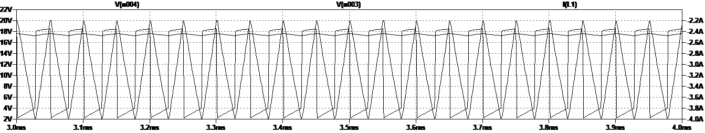
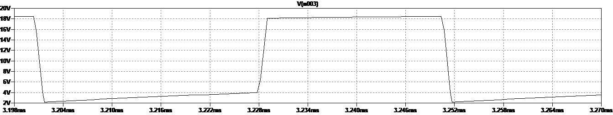
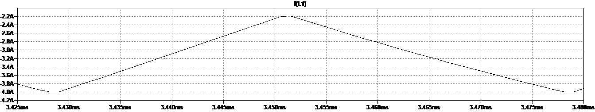
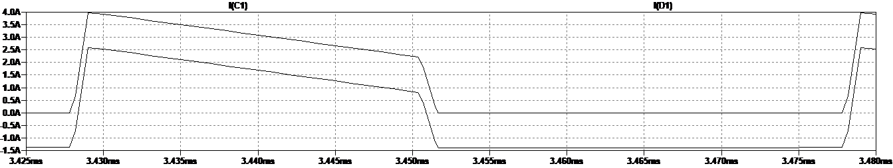
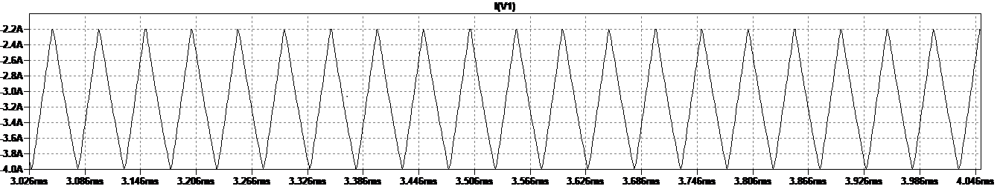

# ECE 5610-002 Lab4
# Laura Parke

--------------------------------------------------------
Lab 4 Items:
- Waveform Captures
Boost Converter Analysis

Abstract:   The characteristics of a simple boost converter were studied in this experiment. The circuit will
was operated under continuous conduction mode (CCM) and open loop conditions, which means no feedback.  We compare 
the theoretical results with the experimental results.  The simulation is used to observe switching waveforms in a 
near-ideal boost converter operating at a fixed duty cycle.  Simulated results are compared to theoretical calculations and experimental results.

Measurements and Waveforms

section 4.4.1: Varying Duty Ratio
----------------------------------------------------------
- duty ratio @ 10%
- Load Resistance = 20 Ω
- Switching Frequency = 100 kHz
- External Input Voltage Vd = 10V (DC Power Supply)

1.  Set the duty ratio to10%, switching frequency at 100 kHz and RL = 20 Ω.

    Vary the duty ratio from 10% to 60% (in steps of 10%):
     
    Duty Ratio _________| 10.0% | 20.0% | 30.0% | 40.0% | 50.0% | 60.0%
    
    Measure the average output voltage for the corresponding duty ratios:
    
    V_o experimental (V)| 10.30 | 11.58 | 13.20 | 15.30 | 18.20 | 21.3

    Calculate the theoretical average output voltage for the corresponding duty ratios:

    V_o theoretical (V)__ | 11.22 | 12.63 | 14.43 | 16.83 | 20.20  | 25.25

2. Set the duty ratio to 50%, switching frequency at 100, 40, 60, 80 kHz and RL = 20 Ω.
   
   Switching Frequency | 100KHz| 40 KHz| 60 KHz| 80 KHz|

   Measure the peak-peak input current ripple:
   
   Ripple Current I_in__ | 44 mA | 45 mA | 43 mA | 40 mA

   Observe and make a copy of the input current (CS5) waveform (see below).

4. Determine the Efficiency.
   
   Set duty ratio at 50%.
   
   Set load resistance RL = 20 Ω.
   
   Measure the RMS output current Io: 0.86 A
   
   Measure the RMS input current Ii: 1.83 A
   
   Measure the RMS output voltage: 17.2 V
   
   Measure the RMS input voltage: 19 V
   
   Calculate the efficiency of the boost converter for different frequencies (60 kHz and 100 kHz) using the above measurements;
   
   eta = P_o/P_in: 16.562 W / 17.3 W = 0.9050 = 90.50 %

   

scope_50:
- Ch1: PWM reference measurement of Power Pole Board -> Duty 10% @ 100kHz
- Ch2: Ouput Voltage measure across load resistor
 
 PWM Reference Signal of Power Pole Board -> Duty 10% @ 100kHz |
:-------------------------:|
 |

scope_51:
- Ch1: PWM reference measurement of Power Pole Board -> Duty 20% @ 100kHz
- Ch2: Ouput Voltage measure across load resistor

   PWM Reference Signal of Power Pole Board -> Duty 20% @ 100kHz |
:-------------------------:|
 |

scope_52:
- Ch1: PWM reference measurement of Power Pole Board -> Duty 30% @ 100kHz
- Ch2: Ouput Voltage measure across load resistor
 PWM Reference Signal of Power Pole Board -> Duty 30% @ 100kHz |
:-------------------------:|
 |

scope_53:
- Ch1: PWM reference measurement of Power Pole Board -> Duty 40% @ 100kHz
- Ch2: Ouput Voltage measure across load resistor
 
 PWM Reference Signal of Power Pole Board -> Duty 40% @ 100kHz |
:-------------------------:|
 |

scope_55:
- Ch1: PWM reference measurement of Power Pole Board -> Duty 60% @ 100kHz
- Ch2: Ouput Voltage measure across load resistor
  
 PWM Reference Signal of Power Pole Board -> Duty 60% @ 100kHz |
:-------------------------:|
 |

-forgot to capture 50% duty measurement waveform capture

section 4.4.2: Varying Switching Frequency
----------------------------------------------------------
- duty ratio @ 50%
- Load Resistance = 20 Ω
- Switching Frequency = 100 kHz
- External Input Voltage Vd = 10V (DC Power Supply)

scope_55:
- Ch1: PWM reference measurement of Power Pole Board @ 100kHz
- Ch2: Input voltage measurement of dc power supply

 PWM Reference Signal of Power Pole Board / Varying the Switching Frequency -> Duty 50% @ 100kHz |
:-------------------------:|
 |

scope_56:
- Ch1: PWM reference measurement of Power Pole Board @ 40kHz
- Ch2: Input voltage measurement of dc power supply

 PWM Reference Signal of Power Pole Board / Varying the Switching Frequency -> Duty 50% @ 40kHz |
:-------------------------:|
 |

scope_57:
- Ch1: PWM reference measurement of Power Pole Board @ 60kHz
- Ch2: Input voltage measurement of dc power supply
- 
 PWM Reference Signal of Power Pole Board / Varying the Switching Frequency -> Duty 50% @ 60kHz |
:-------------------------:|
 |

scope_58:
- Ch1: PWM reference measurement of Power Pole Board @ 80kHz
- Ch2: Input voltage measurement of dc power supply

 PWM Reference Signal of Power Pole Board / Varying the Switching Frequency -> Duty 50% @ 80kHz |
:-------------------------:|
 |

scope_59:
- Ch1: PWM reference measurement of Power Pole Board @ 100kHz
- Ch2: Input voltage measurement of dc power supply

 PWM Reference Signal of Power Pole Board / Varying the Switching Frequency -> Duty 50% @ 100kHz |
:-------------------------:|
 |

section 4.4.3: Determining Efficiency
----------------------------------------------------------
- duty ratio @ 50%
- Load Resistance = 20 Ω
- Switching Frequency = 100 kHz
- External Input Voltage Vd = 10V (DC Power Supply)

scope_5:
- Ch1: PWM reference measurement of Power Pole Board @ 60kHz
- Ch2: Output voltage measured at load resistor

 PWM Reference Signal of Power Pole Board / Varying the Switching Frequency / Load Resistance = 20 Ω -> Duty 50% @ 60kHz |
:-------------------------:|
 |

**Used recorded measured values of 50% duty from section 4.4.1 for calculations of 100kHz

Assignments:

1. Plot the waveforms during the last 10 switching cycles for iL, vL and vo. You need to make sure the
circuit has reached steady state. Depending on the operating conditions, you may need to simulate the
circuit for a much longer time (way more than 10 switching cycles).

 iL, vL, vo |
:-------------------------:|
 |

2. Plot the average value of vL.

  Average value of vL |
 :-------------------------:|
 |

3. Plot iL and measure the peak-peak ripple ΔiL = 1.81 A and compare it with the equation in the text book;: ΔiL = 1/L x Vin x (D x Ts) = 1/100E-6 x 10 x (0.5 x 1E5) = 0.5 A.  This is a 27.7% calculated:measure ratio. 

  peak-peak ripple ΔiL |
 :-------------------------:|
 |

4. Plot idiode and iC waveforms. What is the average value of iC? average value of iC = 1.2982A Compare this iC waveform with the
ripple in idiode. iL - ic waveform = ripple in idiode

  idiode and iC waveforms |
 :-------------------------:|
 |

5. Plot the input current waveform and calculate its average = -3.2367A. Compare that to the value obtained from
the theoretical calculations; Iin = Vo x Io / Vin = 17.411 x 1.39 / 10 = 2.42A.

  input current waveform  |
 :-------------------------:|
 |

6. Calculate the inductance value of L, if ΔiL = 1/3rd of the input current. Verify these computed results
with the results obtained from the simulation.

Calculate the inductance value of L, if ΔiL = 1/3rd of the input current: L = (Vin x D x Ts) / ΔiL ; ΔiL = 2.42A/3 = 0.808 A L = (10 x 0.5 x 1E-5)/ 0.808 = 61.9E-6 H vs the results obtained by the simulation: L = 910 x 0.5x 1E-5 / 1.81 = 27.6 E-6 H. The ratio is 44.7% The actual value is 100E-6 H.

8. Change the output power in this circuit to one-half its original value. Measure the peak-peak ripple
ΔiL and compare it with that in assignment 3. Comment on this comparison.

To Change the output power in this circuit to one-half its original value I reduce the resistance for the load to one half its original value of R = 12.5 ohm to R = 6.25 ohm. The measured peak-to-peak ripple ∆iL = -5.3221 Amps. In assignment 3 the peak-to-peak ∆iL = 0.868 Amps, which gives poor comparison.

10. Calculate Rcrit and verify whether the converter is operating on the boundary of CCM and DCM.

R_crit = (2 x L x f_s)/(1-D) = (2 x 100E-6 x 100000)/0.5 = 40 ohm; The converter is below Rcrit, therefore it is operating on the boundary of DCM.

