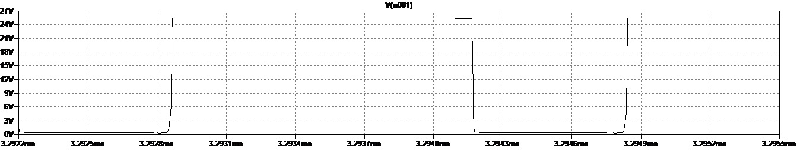
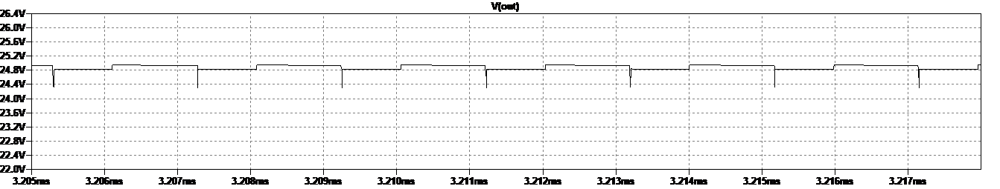
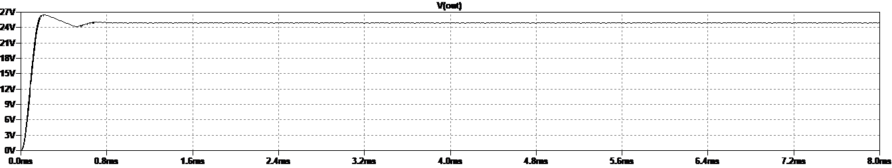
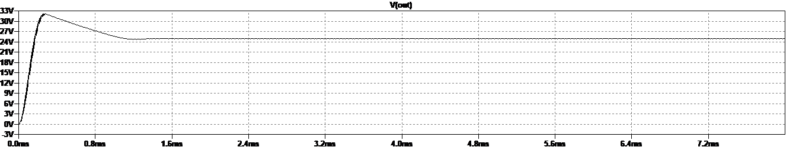
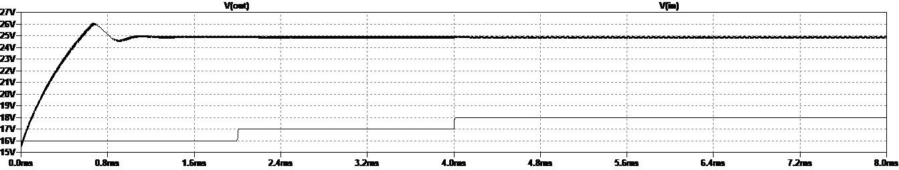

# Laura Parke ECE 5610-002
---------------------------------------------------------
Lab-6: Feedback Control in Boost Converter

Lab 6 Items:
- PSpice Captures

ABSTRACT: The purpose of this lab is to observe closed-loop operation of a boost converter controlled by a current mode controller IC. In this lab we focus on 1) studying a realistic closed-loop boost converter and 2) compare its performance with an open-loop counterpart under various situations.  In the past simulations, both input voltage and load were fixed. In an actual DC-DC converter, not only the load but also the input voltage varies over time. In this simulation we vary the input voltage and load in closed- loop operations.  Next we apply a step load resistance and observe the change in output voltages of the closed-loop and open-loop converters and compare with open-loop operations,

Boost Converter Analysis

Measurements and Waveforms

1. (6 Points) Run the simulation. Attach a zoomed-in waveform of the PWM driving signal of the MOSFET and estimate the switching frequency;  f_s ~ 50505.05 Hz
Compare the switching frequency of this converter with the one in Lab 4.  The switching frequency in Lab4 is 1E5 Hz.  The switching frequency in this lab is 50.5% of the switching frequency in Lab4.

 PWM driving signal of MOSFET |
:-------------------------:|
 |

2. (6 Points) Compare the inductance value with the one in Lab 4. Make comments on the differences based on your observation of assignment 1.  The inductance value in this lab is 10E-6 H vs 100e-6 H in Lab 4.  In a Boost Converter inductance impacts performance.  A larger inductance can store more energy, which means that during the switching cycle the larger inductor can provide more energy to the load.  ΔIL​ is inversely proportional to the inductance.  The smaller inductor can have mmore current ripple  ΔIL​, which leads to output voltage ripple and can effect the stability of the system.  A smaller inductance leads to faster changes in current, which allows fast repspnse to load changes.  A higher inductance reduces ripple and switching losses improving effieciency.  Costs.  A larger inductor has a higher saturation limit. [Dr. Ardakani lecture and notes; chat.pdf]

3. (6 Points) What type of diode is used in this circuit? MBRS340

What’s major difference between this diode and the one we used in Lab 4?  The diode we used in Lab4 is a D.  A D is a generic silicon diode model with forward voltage drop and reverse reocvery time.  The MBRS430 is a Schottky barrier rectifier diode with low forward voltage drop and fast switching speed.  The MRBRS430 is designed for high efficiency power applications [Copilot].

4. (6 Points) Now replace the diode MBRS340 by 1N914, which is a normal silicon diode. Re-run the simulation and attach a zoomed-in waveform of steady-state voltage. Comment on the steady state voltage ripple: A lower inductance increases output voltage ripple and this can effect the stability of the system.

 Zoomed in Waveform of steady-state voltage |
:-------------------------:|
 |

5. (3x2=6 Points) List the advantages and disadvantages of operating at higher frequency.  

Advantages: smaller commponet size, better transient response, smaller output ripple, higher efficency, better control (such as digital control).

Disadvantages: higher switching losses (less efficient), electronmagnetic interference, heat management, component stress, more complex designs.  [Dr. Ardakani lecture and notes, chat.pdf]

6. (5 Points) Summarize what you have learned from assignment 1 to 5.  I learned quite a bit about capacitors and inductors.  I learned that a capacitor can be used as a low pass filter to filter high switching frquencies.  I learned how the size of the inductor or inductance can impact performance and efficiency. Finally, I learned that Dc-Dc converters are essential components in power electronics to convert dc voltage from one level to another.

7. (15 Points) In this assignment, you will apply a step input voltage and observe the change in output voltages of the closed-loop and open-loop converters. Open boost_closeloop.asc and boost_open.asc.
7.1 Run both simulations, notice that the steady state output voltages of these two converters are almost the same under default conditions (see below).

 Zoomed in Waveform of closed-loop steady-state output voltage |
:-------------------------:|
 |

 Zoomed in Waveform of open-looped steady-state output voltage |
:-------------------------:|
 |

7.2 Now you need to replace the constant input voltage by a step voltage (from 16V to 19V, 4 steps).
Once you are done with configuring the input voltage source. Run the simulation. Attach a plot of output voltage in your report.

 Zoomed in Waveform of open-looped step input voltage -> output voltage |
:-------------------------:|
 |

7.3 Apply the same step voltage source to the open-loop converter. Attach a plot of the output voltage. 

 Zoomed in Waveform of open-looped step input voltage -> output voltage |
:-------------------------:|
 |

Comment the differences between 7.2 and 7.3:

7.4 Once you have done. Change the input voltage back to 17V in both schematics.
