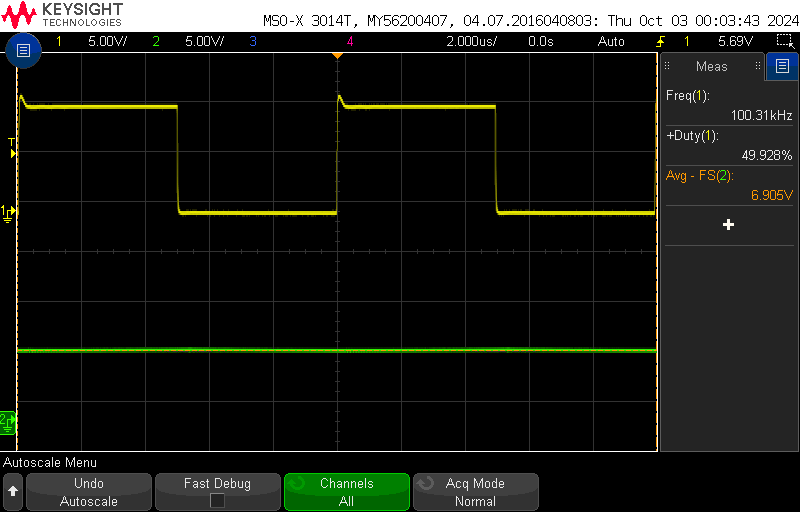
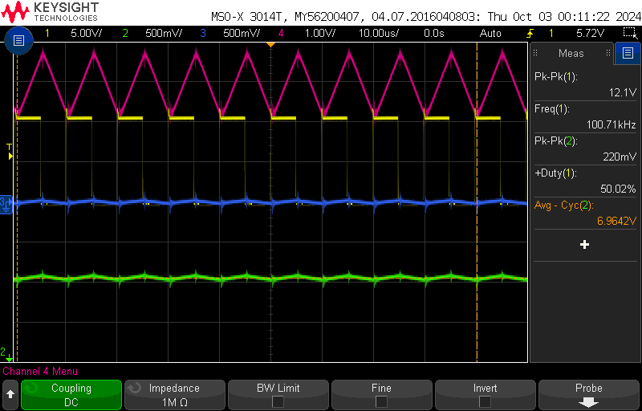
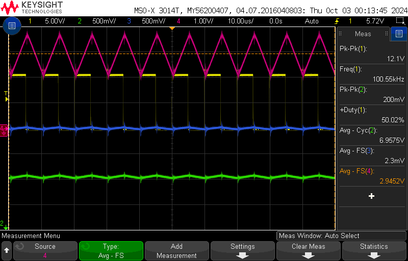
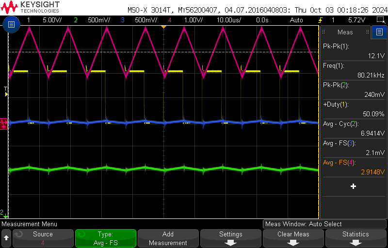
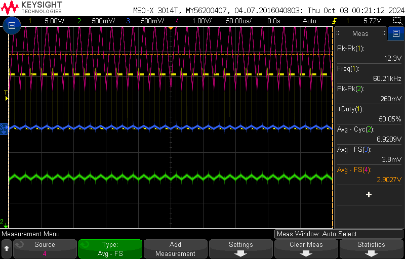
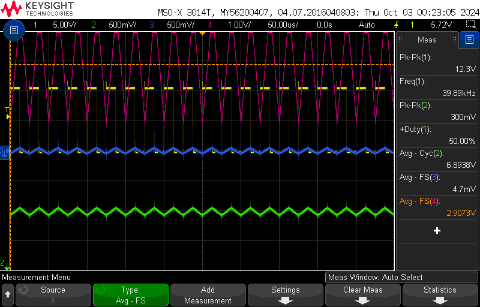

# ECE5610Lab
# Laura Parke
Lab 2 Items:
- Waveform captures

section 2.3: Verify PWM Signal
----------------------------------------------------------
scope_12:
- duty ration @ 50%
- Load Resistance = 10 Ω
- Switching Frequency = 100 kHz
- External Input Voltage Vd = 15V (Power Supply)

 PWM Signal |
:-------------------------:|
 |

section 2.4.1: Varying Duty Ratio
----------------------------------------------------------
scope_13:
- Measuring Output Voltage (average) at 50 % duty
- Ch1: PWM Signal Measurement (For Adjusting Duty Ratio/Freq) -> 50% @ 100kHz
- Ch2: Output Voltage Measurement (Across V2+ and COM on right side of board)

 Average Output Voltage at 50% duty |
:-------------------------:|
 |

-Performed section without capturing each waveform for each duty ratio: measurements
 were recorded in Lab Notebook

section 2.4.2: Varying Switching Frequency
----------------------------------------------------------
scope_14:
- Ch1: PWM Signal  (For Adjusting Duty Ratio/Freq) -> 50% @ 100kHz
- Ch2: Output Voltage and Ripple (Across V2+ and COM on right side of board)
- Ch3: Capacitor Current Voltage (CS4 and COM)
- Ch4: Output Current Voltage (CS5 and COM)

 PWM Signal (For Adjusting Duty Ratio/Freq) -> 50% @ 100kHz|
:-------------------------:|
 |

scope_15:
- Ch1: PWM Signal  (For Adjusting Duty Ratio/Freq) -> 50% @ 80kHz
- Ch2: Output Voltage and Ripple (Across V2+ and COM on right side of board)
- Ch3: Capacitor Current Voltage (CS4 and COM)
- Ch4: Output Current Voltage (CS5 and COM)

 PWM Signal (For Adjusting Duty Ratio/Freq) -> 50% @ 80kHz|
:-------------------------:|
 |

scope_16:
- Ch1: PWM Signal  (For Adjusting Duty Ratio/Freq) -> 50% @ 60kHz
- Ch2: Output Voltage and Ripple (Across V2+ and COM on right side of board)
- Ch3: Capacitor Current Voltage (CS4 and COM)
- Ch4: Output Current Voltage (CS5 and COM)

 PWM Signal (For Adjusting Duty Ratio/Freq) -> 50% @ 60kHz|
:-------------------------:|
 |

scope_17:
- Ch1: PWM Signal  (For Adjusting Duty Ratio/Freq) -> 50% @ 40kHz
- Ch2: Output Voltage and Ripple (Across V2+ and COM on right side of board)
- Ch3: Capacitor Current Voltage (CS4 and COM)
- Ch4: Output Current Voltage (CS5 and COM)

 PWM Signal (For Adjusting Duty Ratio/Freq) -> 50% @ 40kHz|
:-------------------------:|
 |

section 2.4.3: Varying the Load
----------------------------------------------------------
scope_18:
- Ch1: PWM Signal  (For Adjusting Duty Ratio/Freq) -> 50% @ 100kHz
- Ch2: Output Voltage and Ripple (Across V2+ and COM on right side of board)
- Ch3: Capacitor Current Voltage (CS4 and COM)
- Ch4: Output Current Voltage (CS5 and COM)
**Reset to starting conditions with increased time view on the oscilloscope
  Ch1: PWM Signal   Ch2: Output ripple voltage   Ch3: Output current CS5   Ch4: rCAPACITOR CURRENT CS4
:-------------------------:|
 |  

scope_19:
- Ch1: PWM Signal  (For Adjusting Duty Ratio/Freq) -> 50% @ 100kHz
- Ch2: Output Voltage and Ripple (Across V2+ and COM on right side of board)
- Ch3: Capacitor Current Voltage (CS4 and COM)
- Ch4: Output Current Voltage (CS5 and COM)
**Increased load impedance by low amount

scope_22:
- Ch1: PWM Signal  (For Adjusting Duty Ratio/Freq) -> 50% @ 100kHz
- Ch2: Output Voltage and Ripple (Across V2+ and COM on right side of board)
- Ch3: Capacitor Current Voltage (CS4 and COM)
- Ch4: Output Current Voltage (CS5 and COM)
**Increased load impedance more

scope_23:
- Ch1: PWM Signal  (For Adjusting Duty Ratio/Freq) -> 50% @ 100kHz
- Ch2: Output Voltage and Ripple (Across V2+ and COM on right side of board)
- Ch3: Capacitor Current Voltage (CS4 and COM)
- Ch4: Output Current Voltage (CS5 and COM)
**Increased load impedance to Discontinuous Mode

scope_24:
- Ch1: PWM Signal  (For Adjusting Duty Ratio/Freq) -> 50% @ 100kHz
- Ch2: Output Voltage and Ripple (Across V2+ and COM on right side of board)
- Ch3: Capacitor Current Voltage (CS4 and COM)
- Ch4: Output Current Voltage (CS5 and COM)
**Increased load impedance higher

scope_25:
- Ch1: PWM Signal  (For Adjusting Duty Ratio/Freq) -> 50% @ 100kHz
- Ch2: Output Voltage and Ripple (Across V2+ and COM on right side of board)
- Ch3: Capacitor Current Voltage (CS4 and COM)
- Ch4: Output Current Voltage (CS5 and COM)
**Increased load impedance higher

scope_29:
- Ch1: PWM Signal  (For Adjusting Duty Ratio/Freq) -> 50% @ 100kHz
- Ch2: Voltage Across MOSFET - Top
- Ch3: Capacitor Current Voltage (CS4 and COM)
- Ch4: Output Current Voltage (CS5 and COM)
**Unsure of what happened for clipped average to occur, had to replace lower left fuses
  due to being blown open from moving scope probes.

scope_30:
- Ch1: PWM Signal  (For Adjusting Duty Ratio/Freq) -> 50% @ 100kHz
- Ch2: Voltage Across MOSFET - Top
- Ch3: Capacitor Current Voltage (CS4 and COM)
- Ch4: Output Current Voltage (CS5 and COM)
**Unsure of what happened for clipped average to occur, had to replace lower left fuses
  due to being blown open from moving scope probes.

scope_31:
- Ch1: PWM Signal  (For Adjusting Duty Ratio/Freq) -> 50% @ 100kHz
- Ch2: Voltage Across Diode - Top
- Ch3: Capacitor Current Voltage (CS4 and COM)
- Ch4: Output Current Voltage (CS5 and COM)
**Unsure of what happened for clipped average to occur, had to replace lower left fuses
  due to being blown open from moving scope probes.

scope_32:
- Ch1: PWM Signal  (For Adjusting Duty Ratio/Freq) -> 50% @ 100kHz
- Ch2: Voltage Across Diode - Top
- Ch3: Capacitor Current Voltage (CS4 and COM)
- Ch4: Output Current Voltage (CS5 and COM)
**Unsure of what happened for clipped average to occur, had to replace lower left fuses
  due to being blown open from moving scope probes.

section 2.4.4: Determining Efficiency
----------------------------------------------------------
scope_20:
- Ch1: PWM Signal  (For Adjusting Duty Ratio/Freq) -> 50% @ 100kHz
- Ch2: Output Voltage - RMS (Across V2+ and COM on right side of board)
- Ch3: Capacitor Current Voltage (CS4 and COM)
- Ch4: Output Current Voltage - RMS (CS5 and COM)
**Input Voltage = 15V from external power supply

scope_20:
- Ch1: PWM Signal  (For Adjusting Duty Ratio/Freq) -> 50% @ 60kHz
- Ch2: Output Voltage - RMS (Across V2+ and COM on right side of board)
- Ch3: Capacitor Current Voltage (CS4 and COM)
- Ch4: Output Current Voltage - RMS (CS5 and COM)
**Input Voltage = 15V from external power supply

