# ECE 5610-002 Lab
# Laura Parke
Lab 2 Items:
- Waveform captures
  
ABSTRACT- The characteristics of a simple buck converter are observed. The circuit will 
be operated under continuous conduction mode (CCM) and open loop conditions, which means no feedback. We compare the theoretical results of a simple buck converter with the experimental results.  The simulation is used to observe switching waveforms in a near-ideal buck converter operating at a fixed duty cycle. Simulated results are compared to theoretical calculations and experimental results.

Measurements and Waveforms

2.4.1 Varying duty ratio 

Set the duty ratio to 50%, switching frequency at 100 kHz and RL = 10 Ω. 

Vary the duty ratio from 10% to 90% (in steps of 10%). 

Duty Ratio| 10% | 20% | 30% | 40% | 50% | 60% | 70% | 80% | 90%

Measure the average output voltage for the corresponding duty ratios. 

Vo (V)____ | 1.11 | 2.56 | 3.95 | 5.23 | 7.01 | 8.40 | 9.84 | 10.3 | 12.93

Calculate the theoretical average output voltage for the corresponding duty ratios. 

Vo(V) calc | 1.50 | 3.00 | 4.50 | 6.00 | 7.50 | 9.00 | 10.5 | 12.0 | 13.0

2.4.2 Varying switching frequency (see below)

Set the duty ratio to 50%, switching frequency at 100 kHz and RL = 10 Ω. 

Measure the peak-peak output ripple voltage. 

Observe and make a copy of the output ripple voltage, the output current (CS5) and capacitor current 
(CS4) waveforms. 

Repeat the above procedure for different switching frequencies (40 kHz, 60 kHz, and 80 kHz). Make 
sure that duty ratio is maintained at 50%.

fs_________| 100Khz | 80 KHz | 60 KHz | 40 KHz

Vo Rip(V)| 200 mV | 240 mV | 260 mV | 300 mV

iC Amps _| 0.31 A _ | 0.37 A  | 0.37 A  | 0.44 A

2.4.3  Varying the Load (see below)

Set the switching frequency to 100 kHz and duty ratio at 50%. 

Set the load frequency RL = 10 Ω.

Increase the load impedance and observe and make a copy of the output current waveform.

Keep increasing the load impedance until the Buck Converter enters into discontinuous current mode operation.  Note down the average output current value when the converter starts entering discontinuous current mode of operation. 

Io = Vo/R = 53.45 ohms 

2.4.4 Determining efficiency 

Set duty ratio at 50% and load resistance RL = 10 Ω @ 100 KHZ

Measure the RMS output current Io = 491 mA

Measure the RMS input current Ii = 604 mA
. 
Measure the RMS output voltage V2+ = 6.95 V

Measure the RMS input voltage Vd = 15.07 V

Calculate the efficiency of the buck converter for different frequencies (60 kHz and 100 kHz) using the 
above measurements. Pefficiency = V2+xIo/VdxIi = 37.5%

Set duty ratio at 50% and load resistance RL = 10 Ω @ 60 KHZ

Measure the RMS output current Io = 320 mA

Measure the RMS input current Ii = 605 mA
. 
Measure the RMS output voltage V2+ = 6.96 V

Measure the RMS input voltage Vd = 15 v

Calculate the efficiency of the buck converter for different frequencies (60 kHz and 100 kHz) using the 
above measurements. Pefficiency = V2+xIo/VdxIi = 24.5%

Lab Report
Attach a graph showing the output voltage (V2+) versus duty ratio using data obtained in section 
2.4.1. Also plot the theoretically calculated results on the same graph. 

 Varying Dury Ratio at 50% duty |
:-------------------------:|
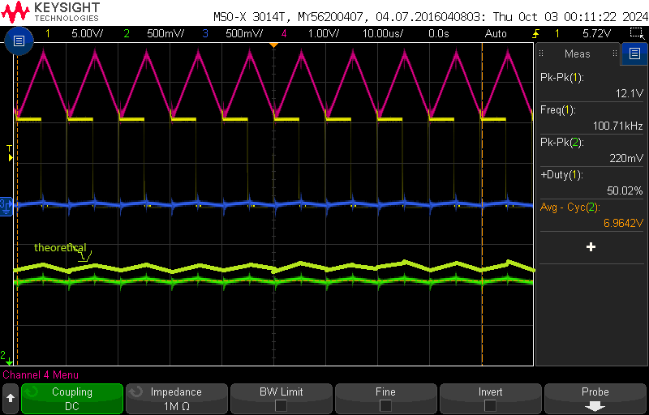 |

Compare these two plots 
and comment on how the buck converter works as a variable dc step down transformer. Enclose 
output voltage & voltage across diode waveforms for duty ratio 50%. 

section 2.3: Verify PWM Signal
----------------------------------------------------------
scope_12:
- duty ration @ 50%
- Load Resistance = 10 Ω
- Switching Frequency = 100 kHz
- External Input Voltage Vd = 15V (Power Supply)

 PWM Signal |
:-------------------------:|
 |

section 2.4.1: Varying Duty Ratio
----------------------------------------------------------
scope_13:
- Measuring Output Voltage (average) at 50 % duty
- Ch1: PWM Signal Measurement (For Adjusting Duty Ratio/Freq) -> 50% @ 100kHz
- Ch2: Output Voltage Measurement (Across V2+ and COM on right side of board)

 Varying Dury Ratio at 50% duty |
:-------------------------:|
 |

-Performed section without capturing each waveform for each duty ratio: measurements
 were recorded in Lab Notebook

section 2.4.2: Varying Switching Frequency
----------------------------------------------------------
scope_14:
- Ch1: PWM Signal  (For Adjusting Duty Ratio/Freq) -> 50% @ 100kHz
- Ch2: Output Voltage and Ripple (Across V2+ and COM on right side of board)
- Ch3: Capacitor Current Voltage (CS4 and COM)
- Ch4: Output Current Voltage (CS5 and COM)

 Varying Duty Ratio/Switching Freq -> 50% @ 100kHz|
:-------------------------:|
 |

scope_15:
- Ch1: PWM Signal  (For Adjusting Duty Ratio/Freq) -> 50% @ 80kHz
- Ch2: Output Voltage and Ripple (Across V2+ and COM on right side of board)
- Ch3: Capacitor Current Voltage (CS4 and COM)
- Ch4: Output Current Voltage (CS5 and COM)

 Varying Duty Ratio/Switching Freq -> 50% @ 80kHz|
:-------------------------:|
 |

scope_16:
- Ch1: PWM Signal  (For Adjusting Duty Ratio/Freq) -> 50% @ 60kHz
- Ch2: Output Voltage and Ripple (Across V2+ and COM on right side of board)
- Ch3: Capacitor Current Voltage (CS4 and COM)
- Ch4: Output Current Voltage (CS5 and COM)

 Varying Duty Ratio/Switching Freq -> 50% @ 60kHz|
:-------------------------:|
 |

scope_17:
- Ch1: PWM Signal  (For Adjusting Duty Ratio/Freq) -> 50% @ 40kHz
- Ch2: Output Voltage and Ripple (Across V2+ and COM on right side of board)
- Ch3: Capacitor Current Voltage (CS4 and COM)
- Ch4: Output Current Voltage (CS5 and COM)

 Varying Duty Ratio/Switching Freq -> 50% @ 40kHz|
:-------------------------:|
 |

section 2.4.3: Varying the Load
----------------------------------------------------------
scope_18:
- Ch1: PWM Signal  (For Adjusting Duty Ratio/Freq) -> 50% @ 100kHz
- Ch2: Output Voltage and Ripple (Across V2+ and COM on right side of board)
- Ch3: Capacitor Current Voltage (CS4 and COM)
- Ch4: Output Current Voltage (CS5 and COM)
**Reset to starting conditions with increased time view on the oscilloscope

 Varying Duty Ratio/Switching Freq -> 50% @ 100kHz|
:-------------------------:|
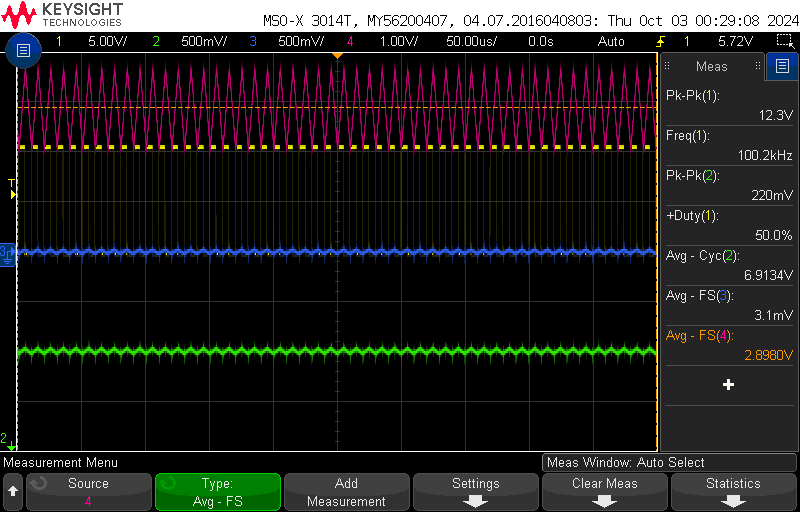 |  

scope_19:
- Ch1: PWM Signal  (For Adjusting Duty Ratio/Freq) -> 50% @ 100kHz
- Ch2: Output Voltage and Ripple (Across V2+ and COM on right side of board)
- Ch3: Capacitor Current Voltage (CS4 and COM)
- Ch4: Output Current Voltage (CS5 and COM)
**Increased load impedance by low amount

 Varying Duty Ratio/Switching Freq -> 50% @ 100kHz w/ small increased Load Resistance|
:-------------------------:|
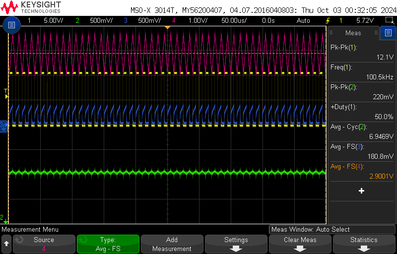 |  

scope_22:
- Ch1: PWM Signal  (For Adjusting Duty Ratio/Freq) -> 50% @ 100kHz
- Ch2: Output Voltage and Ripple (Across V2+ and COM on right side of board)
- Ch3: Capacitor Current Voltage (CS4 and COM)
- Ch4: Output Current Voltage (CS5 and COM)
**Increased load impedance more
  
 Varying Duty Ratio/Switching Freq -> 50% @ 100kHz w/ further increased Load Resistance|
:-------------------------:|
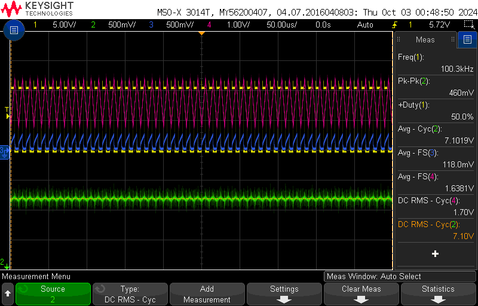 |  

scope_23:
- Ch1: PWM Signal  (For Adjusting Duty Ratio/Freq) -> 50% @ 100kHz
- Ch2: Output Voltage and Ripple (Across V2+ and COM on right side of board)
- Ch3: Capacitor Current Voltage (CS4 and COM)
- Ch4: Output Current Voltage (CS5 and COM)
**Increased load impedance to Discontinuous Mode

 Varying Duty Ratio/Switching Freq -> 50% @ 100kHz w/ increased Load Resistance to DCM|
:-------------------------:|
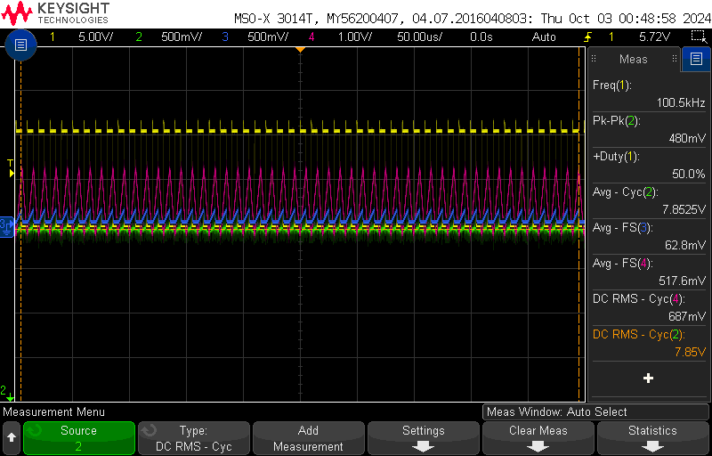 |  

scope_24:
- Ch1: PWM Signal  (For Adjusting Duty Ratio/Freq) -> 50% @ 100kHz
- Ch2: Output Voltage and Ripple (Across V2+ and COM on right side of board)
- Ch3: Capacitor Current Voltage (CS4 and COM)
- Ch4: Output Current Voltage (CS5 and COM)
**Increased load impedance higher
  
 Varying Duty Ratio/Switching Freq -> 50% @ 100kHz w/ further increased Load Resistance|
:-------------------------:|
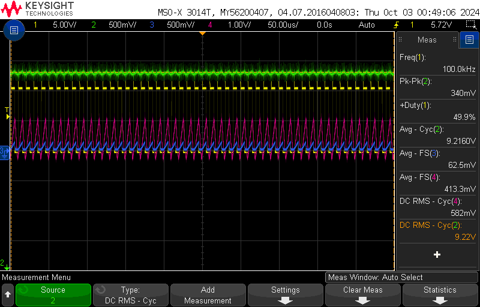 |  

scope_25:
- Ch1: PWM Signal  (For Adjusting Duty Ratio/Freq) -> 50% @ 100kHz
- Ch2: Output Voltage and Ripple (Across V2+ and COM on right side of board)
- Ch3: Capacitor Current Voltage (CS4 and COM)
- Ch4: Output Current Voltage (CS5 and COM)
**Increased load impedance higher

 Varying Duty Ratio/Switching Freq -> 50% @ 100kHz w/ even further increased Load Resistance|
:-------------------------:|
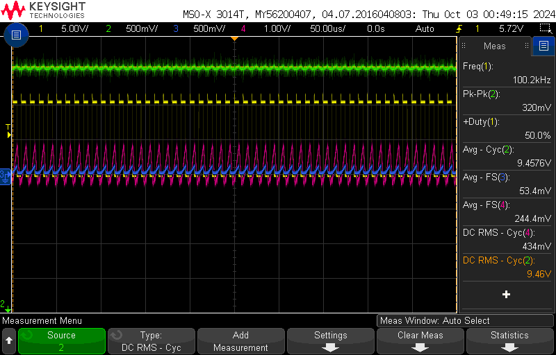 |  

scope_29:
- Ch1: PWM Signal  (For Adjusting Duty Ratio/Freq) -> 50% @ 100kHz
- Ch2: Voltage Across MOSFET - Top
- Ch3: Capacitor Current Voltage (CS4 and COM)
- Ch4: Output Current Voltage (CS5 and COM)
**Unsure of what happened for clipped average to occur, had to replace lower left fuses
  due to being blown open from moving scope probes.

 Varying Duty Ratio/Switching Freq -> 50% @ 100kHz (possibly to high of current -> resistance got turned way down)|
:-------------------------:|
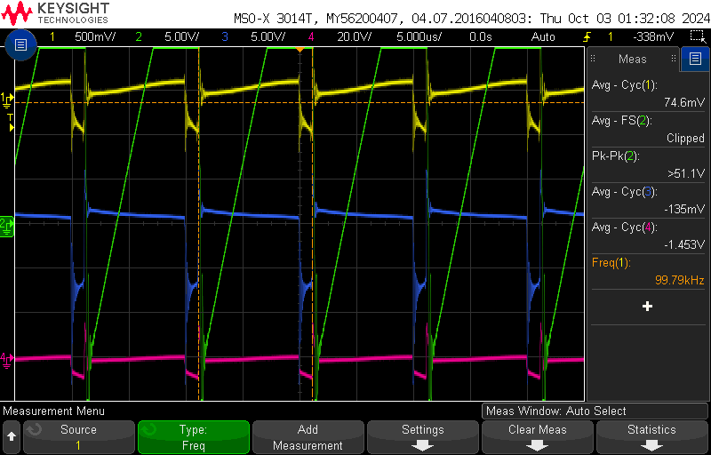 |  

scope_30:
- Ch1: PWM Signal  (For Adjusting Duty Ratio/Freq) -> 50% @ 100kHz
- Ch2: Voltage Across MOSFET - Top
- Ch3: Capacitor Current Voltage (CS4 and COM)
- Ch4: Output Current Voltage (CS5 and COM)
**Unsure of what happened for clipped average to occur, had to replace lower left fuses
  due to being blown open from moving scope probes.

 Varying Duty Ratio/Switching Freq -> 50% @ 100kHz (possibly to high of current -> resistance got turned way down)|
:-------------------------:|
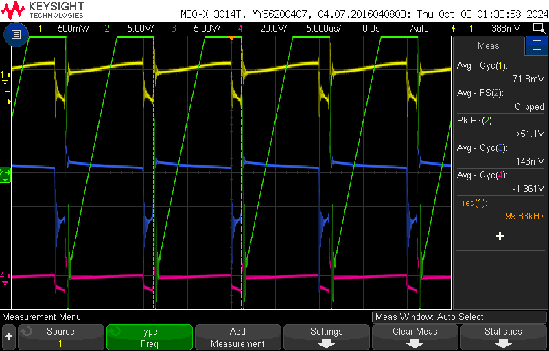 |   

scope_31:
- Ch1: PWM Signal  (For Adjusting Duty Ratio/Freq) -> 50% @ 100kHz
- Ch2: Voltage Across Diode - Top
- Ch3: Capacitor Current Voltage (CS4 and COM)
- Ch4: Output Current Voltage (CS5 and COM)
**Unsure of what happened for clipped average to occur, had to replace lower left fuses
  due to being blown open from moving scope probes.

 Varying Duty Ratio/Switching Freq -> 50% @ 100kHz (possibly to high of current -> resistance got turned way down)|
:-------------------------:|
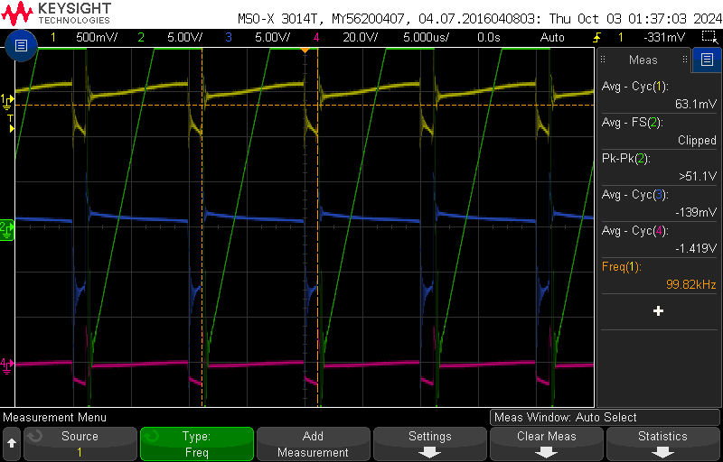 |  

scope_32:
- Ch1: PWM Signal  (For Adjusting Duty Ratio/Freq) -> 50% @ 100kHz
- Ch2: Voltage Across Diode - Top
- Ch3: Capacitor Current Voltage (CS4 and COM)
- Ch4: Output Current Voltage (CS5 and COM)
**Unsure of what happened for clipped average to occur, had to replace lower left fuses
  due to being blown open from moving scope probes.

 Varying Duty Ratio/Switching Freq -> 50% @ 100kHz (possibly to high of current -> resistance got turned way down)|
:-------------------------:|
 |  

section 2.4.4: Determining Efficiency
----------------------------------------------------------
scope_20:
- Ch1: PWM Signal  (For Adjusting Duty Ratio/Freq) -> 50% @ 100kHz
- Ch2: Output Voltage - RMS (Across V2+ and COM on right side of board)
- Ch3: Capacitor Current Voltage (CS4 and COM)
- Ch4: Output Current Voltage - RMS (CS5 and COM)
**Input Voltage = 15V from external power supply

 Determinig Efficiency|
:-------------------------:|
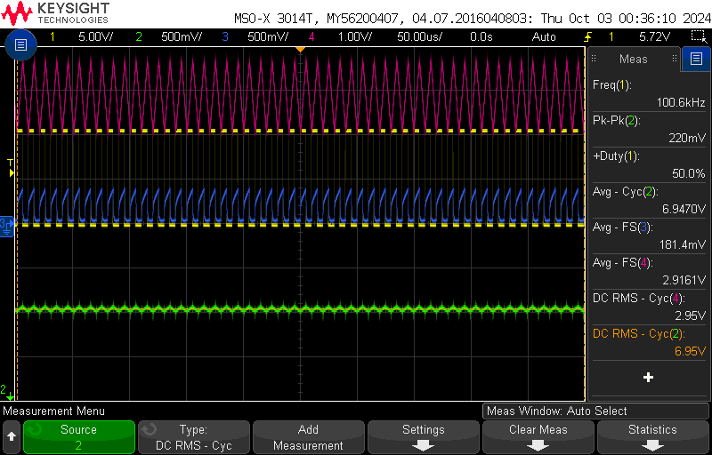 |  

PSpice

Assignments: 
1. Plot the waveforms during the last 10 switching cycles for iL, vL and vo. You need to make sure the 
circuit has reached steady state. Depending on the operating conditions, you may need to simulate the 
circuit for a much longer time (way more than 10 switching cycles).

 Plot iL, vL and vo |
:-------------------------:|
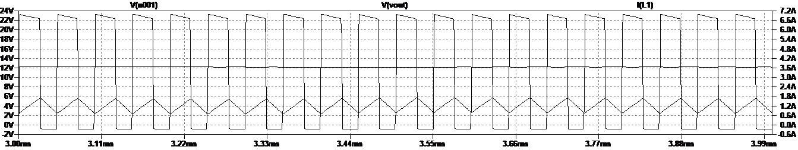 |  

2. Plot the average value of vL. average value of vL = 12.181 V

 Plot the average value of vL |
:-------------------------:|
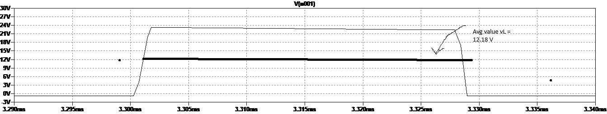 |     
    
3. Plot iL and measure the peak-peak ripple ∆iL and compare it with the equation in the text book.  ∆iL = iLmax - iLmin = 1.72995 A - 0.683534 A = 1.04642 A.

 Plot iL |
:-------------------------:|
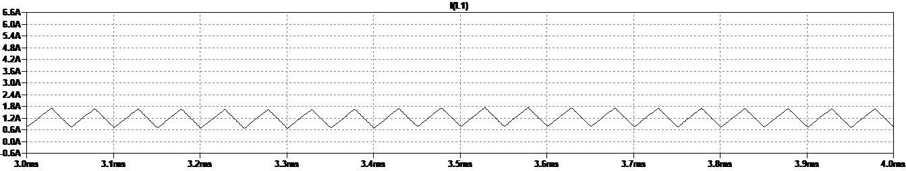 |      

4. Plot iC waveform. What is the average of iC = -121.5 mA. Compare the iC waveform with the ripple in iL.  Both the iC waveform and the ripple in iL are triangular; iL ~ iC.

 Plot iC |
:-------------------------:|
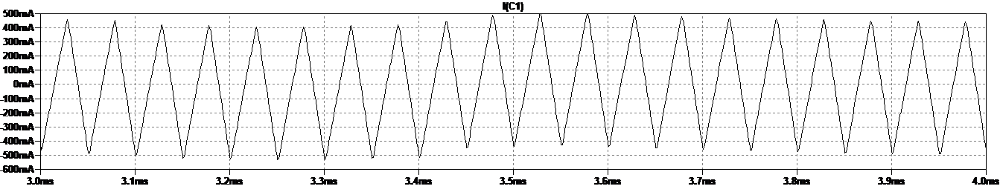 |      

 Plot iC ~ iL |
:-------------------------:|
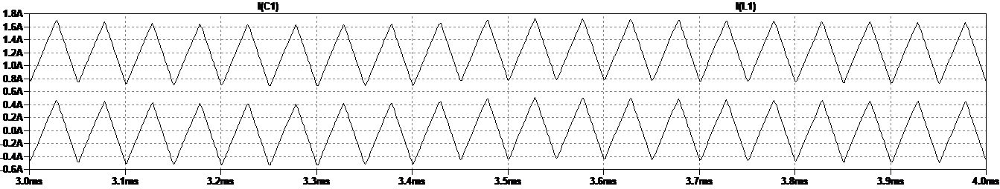 | 

5. Plot the input current waveform and calculate its average. The average input current = -707.86 mA.  Compare that to the value calculated 
theoretically. I_o = I_L = V_0/R1 = 12 V/ 10 ohms = 1.2 Amps. Theoretical average input current Iin = D x I_L = 1.2 Amps x 0.5 = 0.6 Amps.

 Plot i_in |
:-------------------------:|
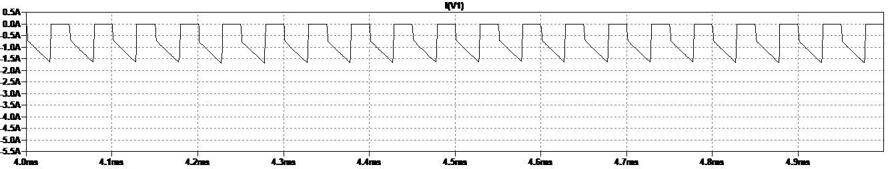 |   

6. Calculate the inductance value of L, if ∆iL should be 1/3rd of the load current. Verify these computed 
results with the results obtained from the simulation.
   L = (Vo(1-D) x Ts)/delta_iL = (12V x 0.5 x 50E-6s)/ 0.4A = 75E-5 F
   For the simulation:
   L = 300E-6 F
   as compared to results from the simulation:
   = (Vo(1-D) x Ts)/delta_iL = (12V x 0.5 x 50E-6s)/ 1.04642A = 287E-6 F 

7. Change the output power in this circuit to one-half its original value. Measure the peak-peak ripple 
∆iL and compare it with that in assignment 3. Comment on this comparison.

To Change the output power in this circuit to one-half its original value I reduce the resistance for the load to one half its original value of R = 10 ohm to R = 5 ohm.  The measured peak-to-peak ripple ∆iL = 0.890303 Amps.  In assignment 3 the peak-to-peak ∆iL = 0.868 Amps, which gives good comparison, 97.5%

 Plot ∆iL |
:-------------------------:|
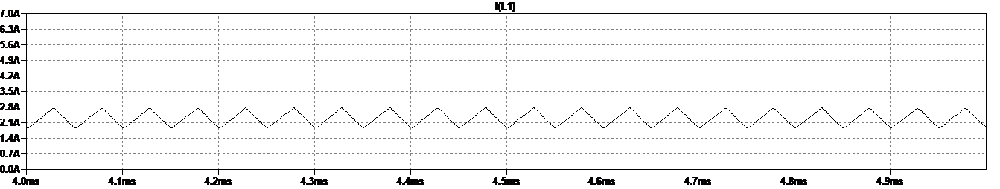 |   

8. Calculate Rcrit and verify whether the converter is operating on the boundary of CCM and DCM.

R_crit = (2 x L x f_s)/(1-D) = (2 x 300E-6 x 20000)/0.5 = 24 ohm;  The converter is below Rcrit, therefore it is operating on the boundary of DCM.

