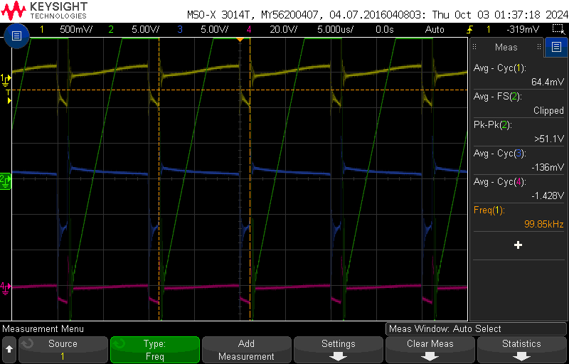

# ECE 5610-002 Lab
# Laura Parke
Lab 2 Items:
- Waveform captures
  
ABSTRACT- The characteristics of a simple buck converter are observed. The circuit will 
be operated under continuous conduction mode (CCM) and open loop conditions, which means no feedback. We compare the theoretical results of a simple buck converter with the experimental results.  The simulation is used to observe switching waveforms in a near-ideal buck converter operating at a fixed duty cycle. Simulated results are compared to theoretical calculations and experimental results.

Measurements and Waveforms

section 2.3: Verify PWM Signal
----------------------------------------------------------
scope_12:
- duty ration @ 50%
- Load Resistance = 10 Ω
- Switching Frequency = 100 kHz
- External Input Voltage Vd = 15V (Power Supply)

 PWM Signal |
:-------------------------:|
 |

section 2.4.1: Varying Duty Ratio
----------------------------------------------------------
scope_13:
- Measuring Output Voltage (average) at 50 % duty
- Ch1: PWM Signal Measurement (For Adjusting Duty Ratio/Freq) -> 50% @ 100kHz
- Ch2: Output Voltage Measurement (Across V2+ and COM on right side of board)

 Varying Dury Ratio at 50% duty |
:-------------------------:|
 |

-Performed section without capturing each waveform for each duty ratio: measurements
 were recorded in Lab Notebook

section 2.4.2: Varying Switching Frequency
----------------------------------------------------------
scope_14:
- Ch1: PWM Signal  (For Adjusting Duty Ratio/Freq) -> 50% @ 100kHz
- Ch2: Output Voltage and Ripple (Across V2+ and COM on right side of board)
- Ch3: Capacitor Current Voltage (CS4 and COM)
- Ch4: Output Current Voltage (CS5 and COM)

 Varying Duty Ratio/Switching Freq -> 50% @ 100kHz|
:-------------------------:|
 |

scope_15:
- Ch1: PWM Signal  (For Adjusting Duty Ratio/Freq) -> 50% @ 80kHz
- Ch2: Output Voltage and Ripple (Across V2+ and COM on right side of board)
- Ch3: Capacitor Current Voltage (CS4 and COM)
- Ch4: Output Current Voltage (CS5 and COM)

 Varying Duty Ratio/Switching Freq -> 50% @ 80kHz|
:-------------------------:|
 |

scope_16:
- Ch1: PWM Signal  (For Adjusting Duty Ratio/Freq) -> 50% @ 60kHz
- Ch2: Output Voltage and Ripple (Across V2+ and COM on right side of board)
- Ch3: Capacitor Current Voltage (CS4 and COM)
- Ch4: Output Current Voltage (CS5 and COM)

 Varying Duty Ratio/Switching Freq -> 50% @ 60kHz|
:-------------------------:|
 |

scope_17:
- Ch1: PWM Signal  (For Adjusting Duty Ratio/Freq) -> 50% @ 40kHz
- Ch2: Output Voltage and Ripple (Across V2+ and COM on right side of board)
- Ch3: Capacitor Current Voltage (CS4 and COM)
- Ch4: Output Current Voltage (CS5 and COM)

 Varying Duty Ratio/Switching Freq -> 50% @ 40kHz|
:-------------------------:|
 |

section 2.4.3: Varying the Load
----------------------------------------------------------
scope_18:
- Ch1: PWM Signal  (For Adjusting Duty Ratio/Freq) -> 50% @ 100kHz
- Ch2: Output Voltage and Ripple (Across V2+ and COM on right side of board)
- Ch3: Capacitor Current Voltage (CS4 and COM)
- Ch4: Output Current Voltage (CS5 and COM)
**Reset to starting conditions with increased time view on the oscilloscope

 Varying Duty Ratio/Switching Freq -> 50% @ 100kHz|
:-------------------------:|
 |  

scope_19:
- Ch1: PWM Signal  (For Adjusting Duty Ratio/Freq) -> 50% @ 100kHz
- Ch2: Output Voltage and Ripple (Across V2+ and COM on right side of board)
- Ch3: Capacitor Current Voltage (CS4 and COM)
- Ch4: Output Current Voltage (CS5 and COM)
**Increased load impedance by low amount

 Varying Duty Ratio/Switching Freq -> 50% @ 100kHz w/ small increased Load Resistance|
:-------------------------:|
 |  

scope_22:
- Ch1: PWM Signal  (For Adjusting Duty Ratio/Freq) -> 50% @ 100kHz
- Ch2: Output Voltage and Ripple (Across V2+ and COM on right side of board)
- Ch3: Capacitor Current Voltage (CS4 and COM)
- Ch4: Output Current Voltage (CS5 and COM)
**Increased load impedance more
  
 Varying Duty Ratio/Switching Freq -> 50% @ 100kHz w/ further increased Load Resistance|
:-------------------------:|
 |  

scope_23:
- Ch1: PWM Signal  (For Adjusting Duty Ratio/Freq) -> 50% @ 100kHz
- Ch2: Output Voltage and Ripple (Across V2+ and COM on right side of board)
- Ch3: Capacitor Current Voltage (CS4 and COM)
- Ch4: Output Current Voltage (CS5 and COM)
**Increased load impedance to Discontinuous Mode

 Varying Duty Ratio/Switching Freq -> 50% @ 100kHz w/ increased Load Resistance to DCM|
:-------------------------:|
 |  

scope_24:
- Ch1: PWM Signal  (For Adjusting Duty Ratio/Freq) -> 50% @ 100kHz
- Ch2: Output Voltage and Ripple (Across V2+ and COM on right side of board)
- Ch3: Capacitor Current Voltage (CS4 and COM)
- Ch4: Output Current Voltage (CS5 and COM)
**Increased load impedance higher
  
 Varying Duty Ratio/Switching Freq -> 50% @ 100kHz w/ further increased Load Resistance|
:-------------------------:|
 |  

scope_25:
- Ch1: PWM Signal  (For Adjusting Duty Ratio/Freq) -> 50% @ 100kHz
- Ch2: Output Voltage and Ripple (Across V2+ and COM on right side of board)
- Ch3: Capacitor Current Voltage (CS4 and COM)
- Ch4: Output Current Voltage (CS5 and COM)
**Increased load impedance higher

 Varying Duty Ratio/Switching Freq -> 50% @ 100kHz w/ even further increased Load Resistance|
:-------------------------:|
 |  

scope_29:
- Ch1: PWM Signal  (For Adjusting Duty Ratio/Freq) -> 50% @ 100kHz
- Ch2: Voltage Across MOSFET - Top
- Ch3: Capacitor Current Voltage (CS4 and COM)
- Ch4: Output Current Voltage (CS5 and COM)
**Unsure of what happened for clipped average to occur, had to replace lower left fuses
  due to being blown open from moving scope probes.

 Varying Duty Ratio/Switching Freq -> 50% @ 100kHz (possibly to high of current -> resistance got turned way down)|
:-------------------------:|
 |  

scope_30:
- Ch1: PWM Signal  (For Adjusting Duty Ratio/Freq) -> 50% @ 100kHz
- Ch2: Voltage Across MOSFET - Top
- Ch3: Capacitor Current Voltage (CS4 and COM)
- Ch4: Output Current Voltage (CS5 and COM)
**Unsure of what happened for clipped average to occur, had to replace lower left fuses
  due to being blown open from moving scope probes.

 Varying Duty Ratio/Switching Freq -> 50% @ 100kHz (possibly to high of current -> resistance got turned way down)|
:-------------------------:|
 |   

scope_31:
- Ch1: PWM Signal  (For Adjusting Duty Ratio/Freq) -> 50% @ 100kHz
- Ch2: Voltage Across Diode - Top
- Ch3: Capacitor Current Voltage (CS4 and COM)
- Ch4: Output Current Voltage (CS5 and COM)
**Unsure of what happened for clipped average to occur, had to replace lower left fuses
  due to being blown open from moving scope probes.

 Varying Duty Ratio/Switching Freq -> 50% @ 100kHz (possibly to high of current -> resistance got turned way down)|
:-------------------------:|
 |  

scope_32:
- Ch1: PWM Signal  (For Adjusting Duty Ratio/Freq) -> 50% @ 100kHz
- Ch2: Voltage Across Diode - Top
- Ch3: Capacitor Current Voltage (CS4 and COM)
- Ch4: Output Current Voltage (CS5 and COM)
**Unsure of what happened for clipped average to occur, had to replace lower left fuses
  due to being blown open from moving scope probes.

 Varying Duty Ratio/Switching Freq -> 50% @ 100kHz (possibly to high of current -> resistance got turned way down)|
:-------------------------:|
 |  

section 2.4.4: Determining Efficiency
----------------------------------------------------------
scope_20:
- Ch1: PWM Signal  (For Adjusting Duty Ratio/Freq) -> 50% @ 100kHz
- Ch2: Output Voltage - RMS (Across V2+ and COM on right side of board)
- Ch3: Capacitor Current Voltage (CS4 and COM)
- Ch4: Output Current Voltage - RMS (CS5 and COM)
**Input Voltage = 15V from external power supply

 Determinig Efficiency|
:-------------------------:|
 |  

PSpice

Assignments: 
1. Plot the waveforms during the last 10 switching cycles for iL, vL and vo. You need to make sure the 
circuit has reached steady state. Depending on the operating conditions, you may need to simulate the 
circuit for a much longer time (way more than 10 switching cycles).

 Plot iL, vL and vo |
:-------------------------:|
 |  

2. Plot the average value of vL. average value of vL = 12.181 V

 Plot the average value of vL |
:-------------------------:|
 |     
    
3. Plot iL and measure the peak-peak ripple ∆iL and compare it with the equation in the text book.  ∆iL = iLmax - iLmin = 1.72995 A - 0.683534 A = 1.04642 A.

 Plot iL |
:-------------------------:|
 |      

4. Plot iC waveform. What is the average of iC = -121.5 mA. Compare the iC waveform with the ripple in iL.  Both the iC waveform and the ripple in iL are triangular.

 Plot iC |
:-------------------------:|
 |      

8. Plot the input current waveform and calculate its average. Compare that to the value calculated 
theoretically. 
9. Calculate the inductance value of L, if ∆iL should be 1/3rd of the load current. Verify these computed 
results with the results obtained from the simulation. 
10. Change the output power in this circuit to one-half its original value. Measure the peak-peak ripple 
∆iL and compare it with that in assignment 3. Comment on this comparison. 
11. Calculate Rcrit and verify whether the converter is operating on the boundary of CCM and DCM. 

